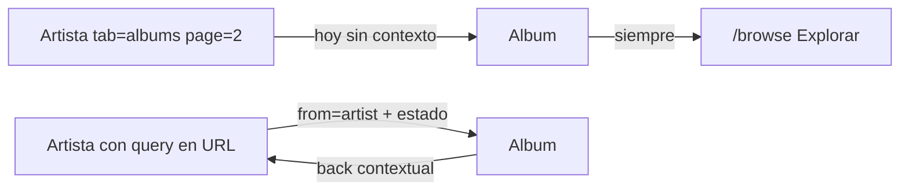

# Volver al origen desde el álbum

## Problema

En [`browse-album.component.html`](frontend/src/app/pages/browse/browse-album.component.html) el back está hardcodeado a Explorar (salvo `from=collection`):

```3:6:frontend/src/app/pages/browse/browse-album.component.html
    @if (fromCollection) {
      <a [routerLink]="['/collection', provider, 'albums']" class="back-link">← Mi Colección</a>
    } @else {
      <a routerLink="/browse" class="back-link">← Explorar</a>
```

Desde el artista, [`albumLink`](frontend/src/app/pages/browse/browse-artist.component.ts) no pasa contexto de retorno, y `albumPage` / `activeTab` / `albumSort` son estado local que se resetea al recargar el artista (`tracks`, página 1). Por eso volver es engorroso aunque uses el historial del browser.



## Enfoque

Seguir el patrón ya usado con `from=collection`: contexto en query params + estado de discografía en la URL del artista.

### 1. Persistir estado del artista en la URL

En [`browse-artist.component.ts`](frontend/src/app/pages/browse/browse-artist.component.ts):

- Leer `tab`, `albumPage`, `trackPage`, `albumSort` desde `queryParamMap` al cargar (defaults actuales si faltan).
- Al cambiar tab / página / sort, actualizar la URL con `router.navigate` + `queryParams` + `queryParamsHandling: 'merge'` + `replaceUrl: true` (sin ensuciar el historial).
- Solo resetear tab/páginas al cambiar de artista (`id`), no en cada emisión de query params.

### 2. Pasar origen al abrir un álbum desde el artista

En [`browse-artist.component.html`](frontend/src/app/pages/browse/browse-artist.component.html), los `routerLink` del álbum llevan query params, por ejemplo:

- `from=artist`
- `artistId=<id>`
- `tab`, `albumPage`, `albumSort` (copia del estado actual)

Así el álbum puede reconstruir el retorno aunque no haya historial (refresh / link directo).

### 3. Back contextual en el álbum

En [`browse-album.component.ts`](frontend/src/app/pages/browse/browse-album.component.ts) + HTML:

- `from=collection` → Mi Colección (como hoy)
- `from=artist` + `artistId` → `/browse/:provider/artists/:artistId` con `tab` / `albumPage` / `albumSort`
- resto → `/browse` (Explorar)

Label dinámico: `← {album.artist_name}` (o `← Artista`) cuando venga del artista; mantener las labels actuales para colección/explorar.

## Archivos a tocar

- [`frontend/src/app/pages/browse/browse-artist.component.ts`](frontend/src/app/pages/browse/browse-artist.component.ts)
- [`frontend/src/app/pages/browse/browse-artist.component.html`](frontend/src/app/pages/browse/browse-artist.component.html)
- [`frontend/src/app/pages/browse/browse-album.component.ts`](frontend/src/app/pages/browse/browse-album.component.ts)
- [`frontend/src/app/pages/browse/browse-album.component.html`](frontend/src/app/pages/browse/browse-album.component.html)

## Fuera de alcance

No sincronizar la búsqueda de Explorar en la URL: desde Explorar el back ya apunta ahí; el dolor principal es el flujo artista → álbum → perder página/pestaña.