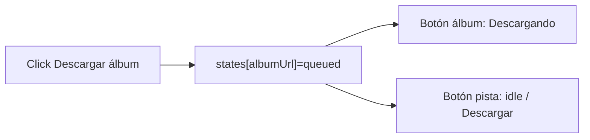

# Spinners en pistas al descargar álbum

## Causa

[`CatalogActionsService`](frontend/src/app/core/catalog-actions.service.ts) guarda el estado por `canonical_url` exacta. Al hacer “Descargar álbum” solo se marca la URL del álbum; cada pista consulta la suya y queda en `idle` → “Descargar”.



## Enfoque

Extender [`catalog-download-button.component.ts`](frontend/src/app/shared/catalog-download-button.component.ts) con un input opcional `parentUrl`. El estado efectivo:

1. Si la URL propia no es `idle` → usar la propia (descarga individual ya en curso o hecha)
2. Si es `idle` y el padre está en `queued` o `done` → heredar el padre
3. Si no → `idle`

Así el spinner aparece en todas las pistas mientras el álbum descarga, y al terminar muestran “Descargado”. Clicks individuales quedan deshabilitados por el mismo `state()` existente.

## Cambios

1. **Botón compartido** — en [`catalog-download-button.component.ts`](frontend/src/app/shared/catalog-download-button.component.ts):
   - Añadir `readonly parentUrl = input<string | null | undefined>()`
   - Cambiar el `computed` de `state` para resolver propia + padre como arriba

2. **Álbum** — en [`browse-album.component.html`](frontend/src/app/pages/browse/browse-album.component.html):
   ```html
   <app-catalog-download-btn
     [url]="hit.canonical_url"
     [parentUrl]="album.canonical_url"
   />
   ```

3. **Playlist** (mismo bug) — en [`browse-playlist.component.html`](frontend/src/app/pages/browse/browse-playlist.component.html): pasar `[parentUrl]="playlist.canonical_url"` en los botones de cada track.

No hace falta tocar el service ni el backend: un solo job de álbum/playlist sigue siendo la fuente de verdad; la UI solo refleja ese estado en los hijos.
