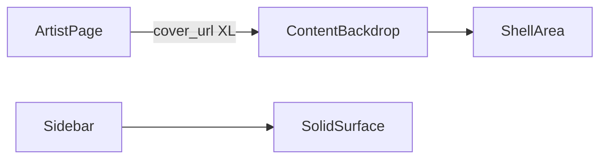

# Fondo de artista en área de contenido

## Enfoque

Al cargar un artista en [`browse-artist`](frontend/src/app/pages/browse/browse-artist.component.ts), pintar su portada como fondo **fixed/absolute solo detrás del área de contenido** (`.shell` / main), con blur + overlay. El sidebar no cambia. Al salir de la ruta, el fondo se limpia solo.

## Backend: imagen más grande

Hoy Deezer mapea `picture_medium` → `coverUrl` en [`DeezerProvider.php`](backend/app/Infrastructure/Providers/Deezer/DeezerProvider.php) (~L154). Para un fondo full-bleed, preferir `picture_xl` (fallback a `picture_big` / `picture_medium`).

- Actualizar el mapeo del artista en `DeezerProvider::getArtist` (y el de search hit de artista si aplica el mismo helper).
- El thumb del hero sigue usando el mismo `cover_url` (XL está bien escalado a 8rem).
- Ajustar mocks en tests de catálogo que fijen `picture_medium` si hace falta para no romper aserciones.

No hace falta un campo nuevo: reutilizar `cover_url` con la URL más grande.

## Frontend: backdrop escopado

Archivos principales:

- [`browse-artist.component.html`](frontend/src/app/pages/browse/browse-artist.component.html)
- [`browse-detail.css`](frontend/src/app/pages/browse/browse-detail.css) (clase artist-only) o CSS propio del artista
- [`browse-artist.component.ts`](frontend/src/app/pages/browse/browse-artist.component.ts)
- Posible toque en [`app.component.css`](frontend/src/app/app.component.css) / `.shell` si hace falta `position: relative` y que el fondo no se vea detrás del sidebar

Implementación concreta:

1. Cuando `artist?.cover_url` exista, renderizar un elemento de fondo (p.ej. `.artist-backdrop`) **dentro** del flujo del contenido, con `position: fixed` acotado al shell (o `absolute` en un wrapper que cubra el scroll del shell), `background-image`, `background-size: cover`, `filter: blur(...)` + capa semitransparente con `var(--bg)` a ~70–85% opacidad.
2. Asegurar `pointer-events: none` y `z-index` bajo las cards.
3. Las cards (`.card`) ya tienen superficie sólida; no hace falta volverlas translúcidas.
4. Limpiar al navegar: al ser parte del template del artista, desaparece con el componente (sin tocar `document.body`).

Detalle técnico del “solo contenido”: `.content` tiene `max-width: 1100px` centrado, pero el gris que se ve alrededor es el `.shell`. El backdrop debe cubrir **todo el `.shell`** (área a la derecha del sidebar), no solo el bloque de 1100px — así el fondo se ve en los márgenes laterales como en la captura.

Opciones de anclaje (elegida): fixed layer con `left: var(--sidebar-width)` (y variante collapsed/mobile vía CSS existente del layout), o un host class en `app` set via un signal/servicio mínimo. Preferencia: **CSS fixed con left según sidebar** desde el componente artista + clase en `html`/`body` solo si hace falta sincronizar collapsed; si es frágil, un `ArtistBackdropService` que el `AppComponent` lea para aplicar `background-image` en `.shell`. La vía más simple y robusta: **servicio ligero + estilo en `.shell`** desde `AppComponent`, set/clear desde el artista en `ngOnInit`/destroy.

Plan de implementación preferido (robusto):

1. Crear `ArtistPageBackdropService` (signal `coverUrl: string | null`).
2. En `BrowseArtistComponent`, al cargar artista setear URL; en destroy / cambio de ruta limpiar.
3. En `AppComponent` template/CSS, aplicar en `.shell` el background + overlay cuando haya URL.
4. Estilos: cover, center, blur (o capa `::before` con la imagen blurreada y `::after` con tint `var(--bg)`).

## Fuera de alcance

- No aplicar el mismo efecto a álbum/playlist en este cambio.
- No cambiar el diseño de las cards ni del hero.
