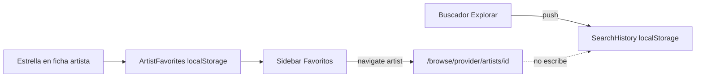

# Explorar: tabs, historial y favoritos

## Alcance

Mejoras solo frontend. Persistencia de historial y favoritos en `localStorage` (mismo patrón que el tema). Sin tablas ni endpoints nuevos.

## 1. Ficha de artista — tabs + paginación + covers

En [`browse-artist.component`](frontend/src/app/pages/browse/browse-artist.component.html) dejar de apilar Top tracks y Discografía juntos.

- Chips/tabs **Tracks** | **Álbumes** (estilo chips de Explorar).
- **Tracks:** listado con `cover_url` (ya viene del album en `mapHit` de Deezer), título, subtítulo, Descargar. Paginación fija **20** por página vía [`PaginationComponent`](frontend/src/app/shared/pagination.component.ts) (ocultar selector “Por página” con un `@Input() showPageSize = false`).
- **Álbumes:** grilla con covers más grandes (~140–160px), título y meta debajo, link al álbum + Descargar. Paginación fija **15** por página.
- Botón estrella en el hero para destacar/quitar el artista (usa el servicio de favoritos del punto 3).

CSS en [`browse-detail.css`](frontend/src/app/pages/browse/browse-detail.css): `.album-grid`, covers grandes; tracks reusan `.hit` con imagen.

## 2. Historial de búsqueda

Servicio [`search-history.service.ts`](frontend/src/app/core/search-history.service.ts):

- Guarda `{ q, provider, type, at }` en `localStorage` (tope ~50).
- **Solo** al enviar el formulario de búsqueda en [`browse.component`](frontend/src/app/pages/browse/browse.component.ts) (`search()`). Navegar desde favoritos **no** escribe historial.

UI en Explorar:

- Header con `row-between`: título a la izquierda; botón **Historial** a la derecha (abre modal).
- Bajo el buscador: chips de los **últimos 3**; click rellena form y vuelve a buscar.
- Modal de historial completo, paginado (p. ej. 10 por página), con re-buscar y borrar ítem / vaciar.

## 3. Favoritos de artistas + sidebar

Servicio [`artist-favorites.service.ts`](frontend/src/app/core/artist-favorites.service.ts):

- Guarda `{ provider, id, name, cover_url }` en `localStorage`.
- `toggle` / `has` / `list` (signal o BehaviorSubject para que la sidebar se actualice).

Sidebar en [`app.component`](frontend/src/app/app.component.html): sección **Favoritos** debajo de la nav principal (después de Configuración o entre Explorar y Playlists — **entre Explorar y Playlists**). Cada ítem enlaza a `/browse/:provider/artists/:id` y cierra el menú móvil. Si no hay favoritos, subtítulo “Sin favoritos”.

Ícono `star` en [`icon.component.ts`](frontend/src/app/shared/icon.component.ts) (outline / filled según estado).

## 4. Fuera de alcance

- Favoritos/historial en backend
- Paginación server-side del catálogo Deezer
- Cambiar la épica v2_content_manager.plan.md

