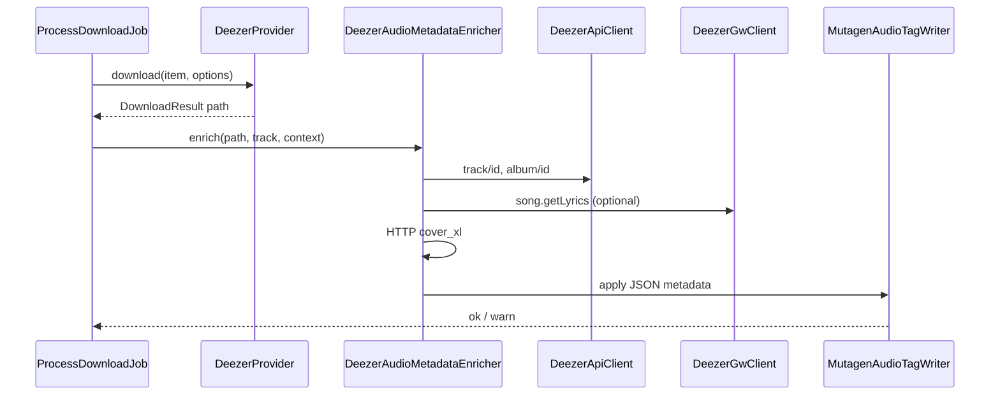

# Enriquecimiento de metadata (Deezer, estilo Murglar)

## Objetivo

Tras cada descarga exitosa **con provider `deezer`** (streamrip **o** hybrid vía yt-dlp), normalizar el archivo en disco con metadata canónica de Deezer: título, artistas, álbum, album artist, nº pista/total, disco, fecha, género, ISRC cuando exista, **carátula embebida**, y **letras** vía GW cuando el ARL lo permita (como [Murglar](https://murglar.app/docs/en/en-index.html)). YouTube Music queda fuera de esta entrega.

## Estado actual (gap)

- Rutas/nombres: [`LocalMusicStorage`](backend/app/Infrastructure/Storage/LocalMusicStorage.php).
- Audio: [`StreamripDeezerDownloader`](backend/app/Infrastructure/Providers/Deezer/StreamripDeezerDownloader.php) / [`YtDlpDownloader`](backend/app/Infrastructure/Downloader/YtDlpDownloader.php) (`--add-metadata` solo en YT).
- Modelo de dominio mínimo: [`Track`](backend/app/Domain/Music/Models/Track.php) — sin compositores, letras, ISRC.
- **No hay** paso post-descarga que re-etiquete; hybrid deja tags de YouTube aunque el `Track` sea Deezer.

## Arquitectura

**Punto único de orquestación** (evita duplicar en providers):

1. [`ProcessDownloadJob`](backend/app/Jobs/ProcessDownloadJob.php) — después de `$result->success`, si `$provider->name() === 'deezer'`.
2. [`ProcessPlaylistSyncJob`](backend/app/Jobs/ProcessPlaylistSyncJob.php) — mismo hook tras `$provider->download()` cuando el playlist provider es Deezer.

Fallo de tagging **no debe marcar el job como failed** si el audio ya está en disco: log + continuar (configurable más adelante). Letras ausentes (sin ARL, track sin lyrics, cuenta sin derecho) = skip silencioso.

## Capa de dominio

| Pieza | Ubicación sugerida |
|-------|-------------------|
| `AudioFileMetadata` (readonly VO) | `backend/app/Domain/Music/ValueObjects/AudioFileMetadata.php` |
| `AudioTagWriter` (port) | `backend/app/Domain/Music/Contracts/AudioTagWriter.php` |
| `TrackMetadataEnricher` (port, opcional) | `backend/app/Domain/Music/Contracts/TrackMetadataEnricher.php` |

Campos en `AudioFileMetadata` (MVP):

- Identidad: `title`, `titleVersion` (si `title_version` en API)
- Artistas: `primaryArtist`, `albumArtist`, `featuredArtists[]`, `composers[]` (desde `contributors` con rol composer/writer cuando venga en JSON)
- Álbum: `albumTitle`, `trackNumber`, `trackTotal`, `discNumber`, `discTotal`
- Fecha: `releaseDate` (año o ISO desde álbum)
- Clasificación: `genres[]`, `isrc`, `deezerTrackId`
- Media: `coverBytes` + mime **o** omitir si setting off
- Lyrics: `lyricsPlain` y/o `lyricsSynced` (LRC) si GW devuelve

## Infraestructura Deezer

**Nuevo** [`DeezerAudioMetadataEnricher`](backend/app/Infrastructure/Metadata/Deezer/DeezerAudioMetadataEnricher.php):

- Entrada: `Track` (con `id` Deezer), contexto opcional `ResolvedKind` + posición en playlist (para `trackTotal` en playlists).
- `GET track/{id}` — ya usado en [`mapTrack`](backend/app/Infrastructure/Providers/Deezer/DeezerProvider.php); reutilizar cliente [`DeezerApiClient`](backend/app/Infrastructure/Providers/Deezer/DeezerApiClient.php).
- `GET album/{id}` — `release_date`, `nb_tracks`, `cover_xl`, `genres`/`genre_id` (mapear a string legible), `contributors` si aplica a nivel álbum.
- **Cache en memoria por job**: clave `albumId` para no repetir `album/{id}` en álbumes/playlists (instancia scoped o array pasado desde el job loop).

**Letras** — extender [`DeezerGwClient`](backend/app/Infrastructure/Providers/Deezer/DeezerGwClient.php):

- Añadir método `trackLyrics(string $arl, string $trackId): ?LyricsPayload` vía el mismo patrón `gw-light.php` que `deezer.getUserData` (p. ej. `song.getLyrics` / equivalente documentado en pruebas manuales con ARL real).
- Requiere ARL del job (`ProviderSettingsResolver::deezerArl($userId)`); sin ARL: tags + cover sí, letras no.
- Spike inicial en implementación: una pista conocida con letras en tests de integración **opcionales** (mock HTTP en unit tests).

**Carátula**: descargar URL `album.cover_xl` (fallback `cover_big`) con timeout corto; no persistir JPG suelto en biblioteca salvo que mutagen falle (solo bytes en memoria).

## Escritura de tags (mutagen)

- [`Dockerfile`](Dockerfile): añadir `mutagen` al `pip install` junto a streamrip.
- Script [`docker/scripts/apply-audio-metadata.py`](docker/scripts/apply-audio-metadata.py): lee JSON por stdin `{ "path": "...", "tags": { ... }, "cover": "base64...", "lyrics": { ... } }`, soporta **mp3** (ID3) y **flac** (Vorbis); m4a best-effort si aparece en hybrid.
- PHP [`MutagenAudioTagWriter`](backend/app/Infrastructure/Metadata/MutagenAudioTagWriter.php): implementa `AudioTagWriter`, invoca `python3` + script, parsea exit code / stderr.

Mapeo mínimo (Audio Station / players comunes):

| Lógico | MP3 | FLAC |
|--------|-----|------|
| Título | TIT2 | TITLE |
| Artista | TPE1 | ARTIST |
| Album artist | TPE2 | ALBUMARTIST |
| Álbum | TALB | ALBUM |
| Pista | TRCK `n/N` | TRACKNUMBER, TRACKTOTAL |
| Disco | TPOS | DISCNUMBER |
| Fecha | TDRC | DATE |
| Género | TCON | GENRE |
| Compositor | TCOM | COMPOSER |
| ISRC | TSRC | ISRC (o comment) |
| Letra | USLT / SYLT | LYRICS / custom |
| Carátula | APIC | METADATA_BLOCK_PICTURE |

## Application service

[`ApplyTrackMetadataHandler`](backend/app/Application/Metadata/ApplyTrackMetadataHandler.php):

- Resuelve settings (`metadata_enrich_enabled`, `metadata_embed_cover`, `metadata_embed_lyrics`).
- Si disabled → no-op.
- Delega a `DeezerAudioMetadataEnricher` + `AudioTagWriter`.
- Registrado en [`MusicHarvesterServiceProvider`](backend/app/Providers/MusicHarvesterServiceProvider.php).

## Configuración

[`config/music.php`](backend/config/music.php) — defaults + env:

- `metadata_enrich_enabled` (default `true`)
- `metadata_embed_cover` (default `true`)
- `metadata_embed_lyrics` (default `true`)
- `metadata_python` / `metadata_script_path` (opcional)

Persistencia en DB (patrón existente):

- Claves en [`EloquentSettingsRepository`](backend/app/Infrastructure/Persistence/EloquentSettingsRepository.php) allowlist.
- Validación en [`UpdateSettingsRequest`](backend/app/Http/Requests/UpdateSettingsRequest.php) + exposición en [`SettingsResource`](backend/app/Http/Resources/SettingsResource.php).
- UI settings: toggles simples en frontend (misma pantalla de ajustes); **sin** verificación browser por regla del repo — solo build si hace falta.

## Tests

- **Unit**: mapper API JSON → `AudioFileMetadata` (fixtures basados en [`DeezerProviderResolveTest`](backend/tests/Feature/DeezerProviderResolveTest.php)).
- **Unit**: `MutagenAudioTagWriter` con mock Process o script stub.
- **Feature**: `ProcessDownloadJob` con provider Deezer mockeado — verifica que se llama `ApplyTrackMetadataHandler` tras éxito.
- **Script**: test Python mínimo (pytest o `python -m unittest`) con archivo mp3/flac de fixture en `backend/tests/fixtures/` (~few KB).

## Fuera de alcance (follow-up)

- Re-tag masivo de biblioteca existente (`artisan downloads:retag`).
- YouTube Music enricher / MusicBrainz.
- Letras desde Genius/Musixmatch.
- Sincronized lyrics LRC avanzado si GW solo entrega plain text en MVP.

## Riesgos

- **GW lyrics**: API no documentada públicamente; implementación guiada por respuesta real + mocks; degradación graceful.
- **Rate limits**: cache de álbum por job; reutilizar delays existentes en playlist sync.
- **Doble tagging streamrip + mutagen**: aceptable; mutagen sobrescribe con fuente Deezer unificada (especialmente crítico en **hybrid**).
