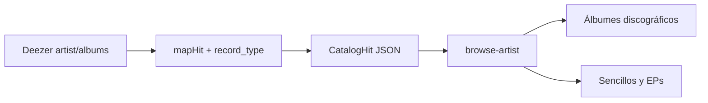

# Separar discografía en álbumes y sencillos/EPs

## Problema

En la pestaña **Álbumes** de un artista ([browse-artist.component.html](frontend/src/app/pages/browse/browse-artist.component.html)) todo se lista junto. Deezer ya clasifica cada release con `record_type` (`album` | `ep` | `single`), pero [DeezerProvider::mapHit](backend/app/Infrastructure/Providers/Deezer/DeezerProvider.php) lo ignora y el frontend no tiene forma de agrupar.

## Enfoque

Propagar `record_type` end-to-end y, en la UI, mostrar dos secciones bajo **Discografía**:

1. **Álbumes discográficos** — `record_type === 'album'` (o ausente/desconocido)
2. **Sencillos y EPs** — `record_type` en `single` | `ep`

El orden elegido (Fecha / Alfabético / Popularidad) se aplica **dentro** de cada sección. Secciones vacías no se muestran.

Paginación: como la API ya trae como máximo 50 releases, se eliminan los paginadores de álbumes y se listan todas las cards de cada sección (evita un paginador global que mezcle tipos).

## Cambios backend

- Añadir `?string $recordType = null` a [CatalogHit.php](backend/app/Domain/Music/ValueObjects/CatalogHit.php).
- En `DeezerProvider::mapHit`, leer `$row['record_type']` cuando sea string no vacío (solo tiene sentido en álbumes; en tracks/artists quedará `null`).
- Incluir `record_type` en [CatalogResource::hit](backend/app/Http/Resources/CatalogResource.php).
- Actualizar fixtures de [CatalogApiTest.php](backend/tests/Feature/CatalogApiTest.php) para assertar el campo en hits de álbum.

## Cambios frontend

- Extender `CatalogHit` en [models.ts](frontend/src/app/core/models.ts) con `record_type?: string | null`.
- En [browse-artist.component.ts](frontend/src/app/pages/browse/browse-artist.component.ts):
  - Reemplazar `pagedAlbums` por getters `discographyAlbums` / `singlesAndEps` que filtran sobre `sortedAlbums`.
  - Quitar estado de paginación de álbumes (`albumPage`, `onAlbumPageChange`) que ya no se use.
- En el template: dos subbloques con subtítulos (`h3`) y cada uno su `album-grid`; chips de orden se mantienen en el header de **Discografía**.
- CSS mínimo en [browse-detail.css](frontend/src/app/pages/browse/browse-detail.css) para espaciar las subsecciones.

## Fuera de alcance

- No cambiar el detalle de álbum ni la búsqueda.
- No inferir tipo por `nb_tracks` (en el listado de artista Deezer suele omitirlo; `record_type` es la fuente correcta).
- No aumentar el límite de 50 releases del provider.