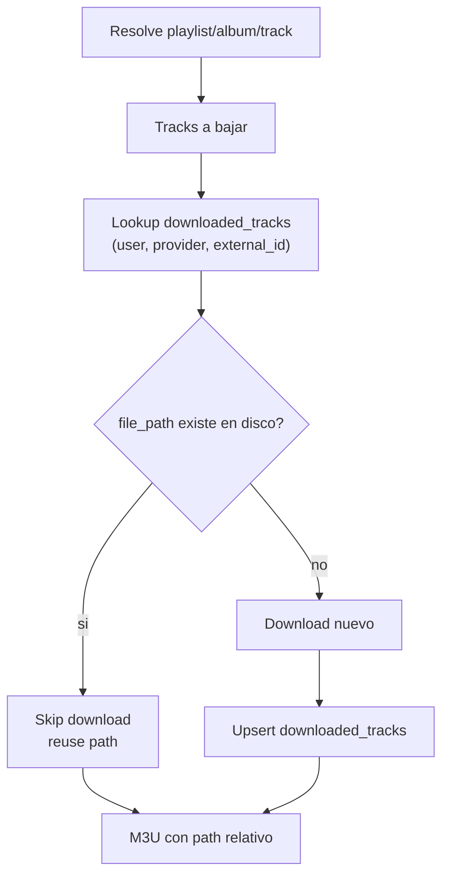

# Dedup de descargas por índice de tracks

## Decisiones

- **Matching:** índice nuevo `downloaded_tracks` (`user_id` + `provider` + `external_id` → `file_path`), poblado en cada descarga exitosa.
- **Playlist:** si el tema ya existe, no re-descargar; marcar `downloaded` con el `file_path` existente; el M3U usa **paths relativos** desde la carpeta de la playlist (no symlink, no segunda copia).

## Flujo

## 1. Schema e índice

Nueva migración + contrato/repo (DDD, estilo actual):

- Tabla `downloaded_tracks`:
  - `user_id` (nullable legacy / scoped)
  - `provider` (string)
  - `external_id` (string — Deezer track id / YTM video id)
  - `file_path` (text)
  - `download_job_id` (nullable FK lógica a `download_jobs`)
  - `saved_playlist_track_id` (nullable)
  - `title` / `artist` (display)
  - timestamps
  - unique `(user_id, provider, external_id)` (tratar `user_id` null como sentinel o índice parcial según Postgres)
- Domain: `DownloadedTrackRepository` + `EloquentDownloadedTrackRepository`
- API interna: `findPresent(userId, provider, externalId)`, `upsert(...)`, `deleteByPaths(list)`, `deleteByJobId(id)`

Al lookup: solo cuenta como hit si el row existe **y** `is_file(file_path)` (misma idea que `files_present`). Si el path murió, borrar/ignorar el índice y permitir re-descarga.

## 2. Poblar el índice en descargas

En [`ProcessDownloadJob`](backend/app/Jobs/ProcessDownloadJob.php), tras cada track exitoso: si `Track->id` está presente, `upsert` al índice con path, provider, user del job.

En [`ProcessPlaylistSyncJob`](backend/app/Jobs/ProcessPlaylistSyncJob.php), tras cada download nuevo: mismo upsert.

En delete/clear de descargas ([`DeleteDownloadHandler`](backend/app/Application/DeleteDownload/DeleteDownloadHandler.php) / cleanup): al borrar archivos de un job, limpiar filas del índice por `download_job_id` o por paths.

**Sin backfill automático** de álbumes viejos (no hay `external_id` por tema en jobs históricos). Los duplicados existentes siguen hasta re-sync/nueva descarga; el índice cubre todo lo nuevo. Opcional post-feature: comando artisan que re-resuelva jobs `done` de álbum y registre paths existentes — fuera del MVP salvo que lo pidas.

## 3. Dedup en sync de playlist

En el loop de pending de `ProcessPlaylistSyncJob`, **antes** de `provider->download`:

1. `findPresent(owner, provider, external_id)`
2. Si hit → `updateTrackStatus(..., Downloaded, filePath: existing)` + regenerar M3U; no llamar al provider
3. Si miss → download actual + upsert índice

Barrido conceptual: ocurre al procesar cada pending (mismo efecto que “antes de descargar, solo las que no están”), sin job extra.

Status UI: se puede reutilizar `downloaded` (path externo a la carpeta playlist es válido). No hace falta status `skipped` nuevo para este caso.

## 4. M3U con paths relativos

Cambiar [`PlaylistM3uWriter`](backend/app/Infrastructure/Storage/PlaylistM3uWriter.php):

- De `basename($filePath)` a path relativo desde `$directory` hacia el archivo (p.ej. `../../artist/album/03 - title.flac`)
- Si el archivo ya está dentro de `$directory`, sigue siendo solo el basename
- Usar lógica portable (`Path` / `realpath` + relativize); tests en `PlaylistM3uWriterTest`

Así una playlist puede mezclar tracks propios de `playlists/{id}-…/` y tracks reutilizados del layout `{artist}/{album}/` sin duplicar audio.

## 5. Extensión a álbum / track one-shot

En `ProcessDownloadJob`, antes de cada `provider->download($item)`:

- Si el item es `Track` con `id` y hay hit en el índice con archivo presente → **omitir** esa iteración (contar como completed para progress, no append path duplicado, o append el path existente si querés que el job refleje ownership — preferencia: append el path existente al job para que delete del job no borre el archivo “ajeno”)

Cuidado en delete: si un job “reutilizó” un path de otro job, **no** borrar ese archivo al borrar el job reutilizador. Regla: solo borrar paths cuyo índice apunta a este `download_job_id` como dueño, o paths bajo el destino “propio” del job. Implementación concreta: al reutilizar, no llamar `appendDownloadedPath` / no asociar el path al job nuevo; solo skip + progress. El índice sigue apuntando al job original.

## 6. Tests

- Unit: relativize M3U (mismo dir vs `../../artist/album/...`)
- Unit/Feature: playlist sync salta download cuando el índice tiene path válido; marca downloaded con ese path
- Unit: one-shot album salta tracks ya indexados
- Unit: delete job limpia índice y no borra archivo de otro job

## Archivos clave

- Nuevo: migración + `DownloadedTrackRepository` + Eloquent impl
- Editar: [`ProcessPlaylistSyncJob.php`](backend/app/Jobs/ProcessPlaylistSyncJob.php), [`ProcessDownloadJob.php`](backend/app/Jobs/ProcessDownloadJob.php), [`PlaylistM3uWriter.php`](backend/app/Infrastructure/Storage/PlaylistM3uWriter.php), delete handlers / `DownloadedFilesCleanup` si hace falta
- Tests existentes de playlist/M3U/download a actualizar

## Fuera de scope

- Dedup cross-provider (Deezer ≠ YTM)
- Matching por ISRC / título-artista
- Backfill de biblioteca histórica
- Cambios UI (salvo que sync muestre menos descargas; no hace falta badge nuevo)