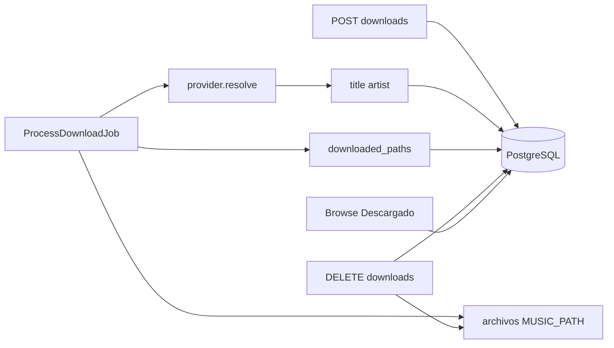

# Historial de descargas + PostgreSQL

## Contexto

Hoy la app usa **SQLite en archivo** (no Redis), montado en el volumen `app_database`. Eso se pierde fácil con `docker compose down -v`, montajes mal puestos, o al confundirlo con el SQLite `:memory:` de [`phpunit.xml`](phpunit.xml). Para esta feature pasamos a **PostgreSQL** como store durable de jobs, cola, sessions, cache y playlists.

Además:

- Guardar y mostrar **título** / **artista** en descargas
- **Borrar** historial (uno o todos) + archivos
- **Paginar** el listado (client-side)
- **Sincronizar** badge "Descargado" de Browse con historial + archivos reales

### Bug Browse vs Descargas

[`CatalogActionsService`](frontend/src/app/core/catalog-actions.service.ts) persiste URLs `done` en `localStorage` y al hidratar **mergea** sin quitar entradas ausentes del historial → Browse muestra "Descargado" con historial vacío y sin archivos.

Regla de sync:

- **Descargado** ⇔ job `done` para esa URL **y** `files_present === true`
- Historial vacío ⇒ ningún badge Descargado
- Borrar historial ⇒ borra archivos + limpia badges
- Archivos borrados a mano ⇒ deja de contar como Descargado; el job sigue en Descargas hasta borrarlo

## 0. Infra: SQLite → PostgreSQL

Hacer esto **primero**; el resto del feature asume Postgres en runtime.

### Compose

En [`docker-compose.yml`](docker-compose.yml):

- Servicio `db`: `postgres:16-alpine`, volumen nombrado `pg_data`, healthcheck `pg_isready`
- Env compartido en app/worker/scheduler:
  - `DB_CONNECTION=pgsql`
  - `DB_HOST=db`
  - `DB_PORT=5432`
  - `DB_DATABASE=music_harvester`
  - `DB_USERNAME` / `DB_PASSWORD` (defaults + override por `.env`)
- `depends_on: db (condition: service_healthy)` en app (worker/scheduler ya esperan app healthy)
- **Quitar** volumen `app_database` y sus mounts sobre `/var/www/html/database` (ya no hace falta el sqlite file ni el sync de migrations al volumen)
- Mantener `app_storage` + `music_data`

Actualizar [`docker-compose.synology.yml`](docker-compose.synology.yml), [`docker-compose.override.yml`](docker-compose.override.yml) / [`docker-compose.dev.yml`](docker-compose.dev.yml): sin `app_database`; el servicio `db` viene del base compose.

### Imagen PHP

En [`Dockerfile`](Dockerfile) (stage `app`):

- Instalar `libpq-dev` + `pdo_pgsql` (se puede dejar `pdo_sqlite` solo si queremos tests en imagen; no es obligatorio en runtime)
- Simplificar el truco de `/usr/local/share/mh-migrations` (ya no hay volume tapando `database/migrations`); migrations viven en el código de la imagen / bind-mount

### Entrypoint

[`docker/php/entrypoint.sh`](docker/php/entrypoint.sh):

- Quitar `touch database/database.sqlite` y el sync de migrations al volume
- Esperar a Postgres (`pg_isready` o loop PHP/PDO) antes de `migrate --force`
- Seguir con `chown` solo de `storage` / `bootstrap/cache`

### Config / docs

- [`.env.example`](.env.example): vars `pgsql` documentadas; sqlite como nota legacy opcional
- Default en compose = Postgres; PHPUnit sigue en **SQLite `:memory:`** para tests rápidos (no cambiar a Postgres en CI local salvo que haga falta)
- Actualizar [`docs/synology.md`](docs/synology.md) / README: volumen `pg_data`, no más `app_database` / “readonly sqlite”
- Healthcheck de app puede seguir siendo `migrate:status` una vez DB up

**Nota migración de datos:** no hay dump SQLite→Postgres automático en este plan; entorno limpio con `migrate`. Quien tenga datos en SQLite debe exportar a mano o aceptar reset.

## 1. Schema y repositorio

Nueva migración sobre `download_jobs`:

- `title` nullable string
- `artist` nullable string (track/album; playlist `null`)
- `downloaded_paths` nullable JSON

Extender [`DownloadJobRepository`](app/Domain/Music/Contracts/DownloadJobRepository.php) + [`EloquentDownloadRepository`](app/Infrastructure/Persistence/EloquentDownloadRepository.php):

- `updateMetadata` / `appendDownloadedPath` / `delete` / `deleteAll`
- Seguir con `listRecent(limit)` (cap ~200)

## 2. Metadata y paths al procesar

En [`ProcessDownloadJob`](app/Jobs/ProcessDownloadJob.php) tras `resolve`: guardar title/artist; en cada éxito, `appendDownloadedPath`.

## 3. Borrado historial + archivos

`DeleteDownloadHandler` / `ClearDownloadsHandler` + cleanup solo bajo `music_path`.

- `DELETE /api/downloads/{id}`
- `DELETE /api/downloads`

## 4. API resource + `files_present`

[`DownloadJobResource`](app/Http/Resources/DownloadJobResource.php): `title`, `artist`, `files_present`.

## 5. Sync CatalogActionsService

Reconstruir estado solo desde `/downloads` (replace, no merge sticky). `done` solo si `status === 'done' && files_present`. Quitar autoridad de `localStorage`.

## 6. Frontend Descargas

Metadata, trash/vaciar, paginación client-side, indicador "Archivos ausentes", notify catalog al borrar.

## Fuera de alcance

- Migración automática de datos SQLite existentes → Postgres
- Escanear `/music` para inferir descargas sin job
- Cambiar layout de carpetas de playlists one-shot
