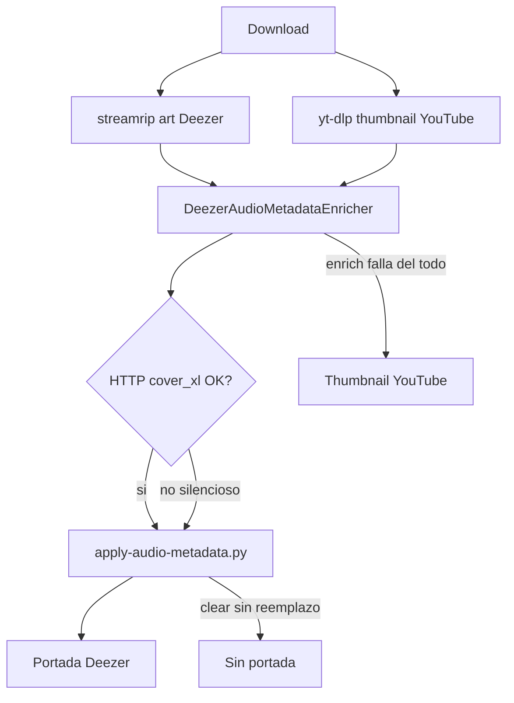

# Fix portadas en descargas

## Diagnóstico

Hay **dos fuentes** de portada y un post-proceso que a veces las destruye:

**Por qué a veces sí / a veces no:** en [`DeezerAudioMetadataEnricher::downloadCover`](backend/app/Infrastructure/Metadata/Deezer/DeezerAudioMetadataEnricher.php) cualquier fallo HTTP/timeout/vacío devuelve `[null, null]` sin log. Luego mutagen en [`apply-audio-metadata.py`](docker/scripts/apply-audio-metadata.py) hace `frames.clear()` / `clear_pictures()` / `audio.clear()` y solo re-agrega cover si hay bytes → archivo sin portada.

**Por qué a veces cualquier cosa:** en modo hybrid, yt-dlp usa `--embed-thumbnail` ([`YtDlpDownloader`](backend/app/Infrastructure/Downloader/YtDlpDownloader.php)). Si el enrich falla o no trae cover, queda el thumb del video de YouTube (remix / lyric video / otro tema).

Fuera de alcance inmediato: descargas puras de YouTube Music (nunca pasan por el enricher Deezer).

## Enfoque

Prioridad: nunca dejar el archivo peor que antes respecto a portada, y hacer el fetch de Deezer confiable.

### 1. Preservar portada existente si no hay reemplazo

En [`docker/scripts/apply-audio-metadata.py`](docker/scripts/apply-audio-metadata.py):

- Si llega `cover` → comportamiento actual (limpiar y embeber la de Deezer).
- Si `cover` es null → reescribir tags/letras **sin tocar** APIC / pictures / `covr` ya embebidos (streamrip o thumbnail previo).

Así un CDN flaky no deja tracks sin carátula.

### 2. Endurecer fetch de cover en el enricher

En [`DeezerAudioMetadataEnricher`](backend/app/Infrastructure/Metadata/Deezer/DeezerAudioMetadataEnricher.php):

- Cachear bytes + mime por album id (hoy solo cachea JSON de álbum; cada track re-descarga la misma imagen).
- Retry corto (3 intentos con backoff leve) ante fallo HTTP/timeout.
- Log warning cuando, con `embedCover=true`, no se obtiene portada (URL, status, track/album id).
- Validar magic bytes mínimos (JPEG / PNG) antes de aceptar el body.
- Si el `album/{id}` falla, no cachear el embedded flaco como definitivo; solo cachear respuesta completa exitosa.

### 3. Tests

- Unit enricher: cover cache por álbum (1 sola HTTP de imagen para 2 tracks), retry, null cover.
- Script Python: con `cover=null`, pictures previas sobreviven; con cover nuevo, se reemplazan.
- Extender [`DeezerAudioMetadataEnricherTest`](backend/tests/Unit/DeezerAudioMetadataEnricherTest.php).

### 4. Fuera de este plan

- Race de newest file en streamrip bajo concurrencia.
- Portadas oficiales para YouTube Music puro.
- Job de re-tag de archivos ya descargados (se puede hacer después).

## Archivos principales

- [`docker/scripts/apply-audio-metadata.py`](docker/scripts/apply-audio-metadata.py) — preserve pictures
- [`backend/app/Infrastructure/Metadata/Deezer/DeezerAudioMetadataEnricher.php`](backend/app/Infrastructure/Metadata/Deezer/DeezerAudioMetadataEnricher.php) — retry, cache bytes, logs, no cachear album fallido
- Tests unitarios del enricher (+ script si aplica)
