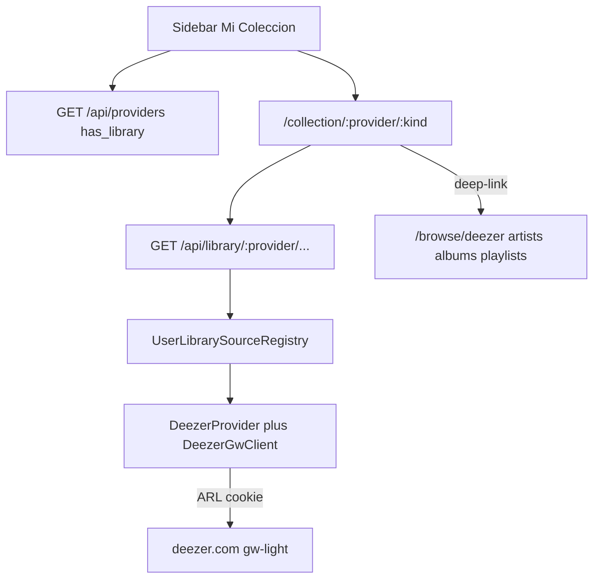

# Mi Colección por proveedor (Deezer ARL)

## Evaluación: YouTube Music vs Deezer

- **Deezer (ARL):** hoy solo descarga FLAC (streamrip). El ARL **sí puede** abrir la biblioteca del usuario con un cliente autenticado (gateway no oficial `gw-light`). La API pública de Explorar no usa ARL.
- **YouTube Music (cookies Netscape):** solo autentican yt-dlp para resolve/download de URLs conocidas. **No** listan liked songs / library. ARL es exclusivo de Deezer; YTM no usa ARL. Mi Colección YTM quedaría para un futuro cliente tipo ytmusicapi — **fuera de esta entrega**.

## Arquitectura

Separar catálogo público (`CatalogSource` / Explorar) de biblioteca autenticada (`UserLibrarySource` / Mi Colección). Un provider futuro aparece cuando implemente library y tenga credencial cargada.

## Backend

### 1. Contrato UserLibrarySource

Nuevo en [app/Domain/Music/Contracts/UserLibrarySource.php](app/Domain/Music/Contracts/UserLibrarySource.php):

- `name()`, `favoriteArtists()`, `favoriteAlbums()`, `lovedTracks()`, `playlists()`
- Reutilizar DTOs de catalog (`CatalogHit` / shapes de browse)
- Registry + tag `music.user_library_sources` (espejo de [CatalogSourceRegistry](app/Infrastructure/Providers/CatalogSourceRegistry.php)), filtrado por `enabled_providers`

### 2. Cliente Deezer autenticado (ARL)

Nuevo `DeezerGwClient` junto a [DeezerApiClient](app/Infrastructure/Providers/Deezer/DeezerApiClient.php):

1. Cookie `arl` → `deezer.getUserData` → `user_id` + `api_token`
2. Favoritos / playlists del usuario
3. Mapear URLs canónicas `deezer.com/...` para download y fichas browse

`DeezerProvider` implementa `UserLibrarySource`. **Library requiere ARL** (`isArlConfigured()`). Hybrid sin ARL no muestra Mi Colección.

### 3. API REST

Extender [ListProvidersHandler](app/Application/ListProviders/ListProvidersHandler.php) con `has_library: bool` (tiene source + ARL para Deezer).

Rutas:

- `GET /api/library/{provider}/artists|albums|tracks|playlists`

Errores claros si falta library/ARL. Tests feature.

### 4. Docs

Actualizar [docs/providers.md](docs/providers.md): ARL también alimenta Mi Colección; cookies YTM no listan biblioteca; riesgos de gw-light / ARL caduco.

## Frontend

### 5. Sidebar — debajo de Favoritos

En [app.component.html](frontend/src/app/app.component.html), después del `nav-section` Favoritos y antes de Playlists:

- Sección **Mi Colección**
- Por cada provider con `has_library`: fila colapsable con nombre del provider
- Expandido: Mis artistas / Mis canciones / Mis álbumes / Mis playlists → `/collection/:provider/{artists|tracks|albums|playlists}`
- Vacío si ninguno tiene library
- Persistencia expand/collapse en `localStorage`
- Compatible con rail colapsado

### 6. Páginas de lista

Rutas en [app.routes.ts](frontend/src/app/app.routes.ts): `/collection/:provider/artists|albums|tracks|playlists`

Reutilizar UI de browse: download buttons; deep-link a `/browse/:provider/.../:id?from=collection`; tracks solo descarga in-place; playlists con Destacar/sync.

### 7. Extensibilidad

Nuevo provider: implementar `UserLibrarySource`, registrar tag, `has_library` cuando su cookie esté cargada — la sidebar lo lista sola.

## Alcance

- **Incluye:** Deezer Mi Colección + UI + contrato + docs del veredicto YTM
- **No incluye:** biblioteca YouTube Music, OAuth Deezer, ni mezclar Favoritos locales con Mis artistas del provider
