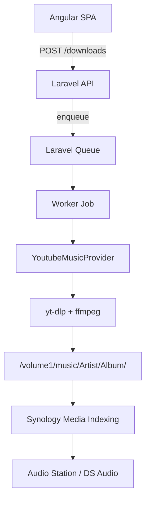

# Music Harvester — Laravel + Angular en Synology

## Decisión de stack

- **Backend:** Laravel (PHP 8.4) + SQLite + Queue + Scheduler
- **Frontend:** Angular SPA (tecnologías que ya conocés)
- **Downloader:** `yt-dlp` + `ffmpeg` dentro de la imagen del worker
- **Deploy:** Docker Compose en el NAS (`app`, `worker`, `nginx`)
- **Biblioteca real:** filesystem (`/volume1/music`) — la DB solo guarda jobs/estado/config
- **MVP provider:** YouTube Music (URL de track/playlist/álbum). Spotify queda como interfaz lista, sin implementación.

Descartamos Livewire/Tailwind para no fricción de aprendizaje. El costo es más setup (CORS, auth JWT/sanctum, build Angular), aceptable.

## Flujo del sistema



## Arquitectura DDD (sin sobreingeniería)

Estructura Laravel:

```
app/Domain/
  Music/
    Models: Track, Album, Artist, Playlist
    Contracts: MusicProvider
    ValueObjects: AudioFormat, DownloadStatus, MusicUrl

app/Application/
  DownloadTrack / DownloadPlaylist / RetryDownload / ListDownloads

app/Infrastructure/
  Providers/YoutubeMusic/YoutubeMusicProvider
  Downloader/YtDlpDownloader
  Storage/LocalMusicStorage
  Persistence/EloquentDownloadRepository
```

Contrato mínimo del provider:

```php
interface MusicProvider
{
    public function supports(string $url): bool;
    public function resolve(string $url): ResolvedMusic; // track|playlist|album
    public function download(ResolvedItem $item, DownloadOptions $options): DownloadResult;
}
```

Spotify después implementa el mismo contrato: resolver playlist vía API → match en YouTube → download con `yt-dlp`. El dominio no cambia.

## MVP funcional (v1)

1. Angular: form para pegar URL + formato (mp3 320 / m4a) + botón Descargar
2. API: crea `DownloadJob`, responde `202` + id
3. Worker: detecta provider → `yt-dlp` → escribe en:
   `/volume1/music/{artist}/{album}/{index} - {title}.{ext}`
4. Metadata: embed thumbnail + tags (`--embed-thumbnail --add-metadata`)
5. UI: lista de jobs (pending/running/done/failed) + reintento
6. Config: path de música, cookies de YouTube (archivo montado), concurrency

**Fuera de v1:** buscador integrado, sync periódico de playlists, usuarios multi-tenant, plugins externos, Spotify.

## Modelo de datos (SQLite)

- `download_jobs`: id, provider, url, kind, status, progress, error, destination_path, options_json, timestamps
- `settings`: key/value (music_path, default_format, max_concurrency, cookies_path)
- Opcional liviano: `tracks` solo como índice de lo descargado (path + títulos) — no duplicar la biblioteca de Audio Station

## Docker en Synology

```yaml
services:
  app:      # php-fpm + Laravel
  nginx:    # sirve API + Angular dist/
  worker:   # php artisan queue:work (misma imagen, yt-dlp+ffmpeg)
```

- Volume: `/volume1/music` → `/music` (RW)
- Volume: cookies/`cookies.txt` (RO) para YouTube Music autenticado
- Network: puerto `8085` en dev local (o el que uses en Container Manager)
- Queue driver: `database` (sin Redis en el MVP)

## Angular (v1)

Rutas mínimas:

- `/` — nueva descarga
- `/downloads` — cola/historial
- `/settings` — path, formato default, cookies status

Auth: Laravel Sanctum (cookie/session en misma origen vía nginx, o token si se sirve desde rutas distintas). Preferencia: **nginx sirve Angular + proxy `/api` → Laravel** para evitar CORS.

## Riesgos a cubrir en implementación

- **Cookies YTM:** sin cookies, muchas playlists fallan; documentar export desde browser
- **Carga del NAS:** 1 job concurrente por default (ARM/x86 Synology)
- **Actualización yt-dlp:** job/cron semanal `yt-dlp -U` o rebuild de imagen
- **Legalidad:** uso personal; el proyecto no bypass DRM de Spotify oficial
- **Audio Station:** asegurar que `/music` esté en Media Indexing; la app no llama a DSM

## Orden de implementación

1. Scaffold Laravel + DDD folders + Docker Compose base
2. `YtDlpDownloader` + `YoutubeMusicProvider` + job de descarga (CLI primero)
3. API REST de downloads + SQLite
4. Angular UI mínima + nginx
5. Settings + cookies + reintentos
6. Documentación de deploy en Synology Container Manager
