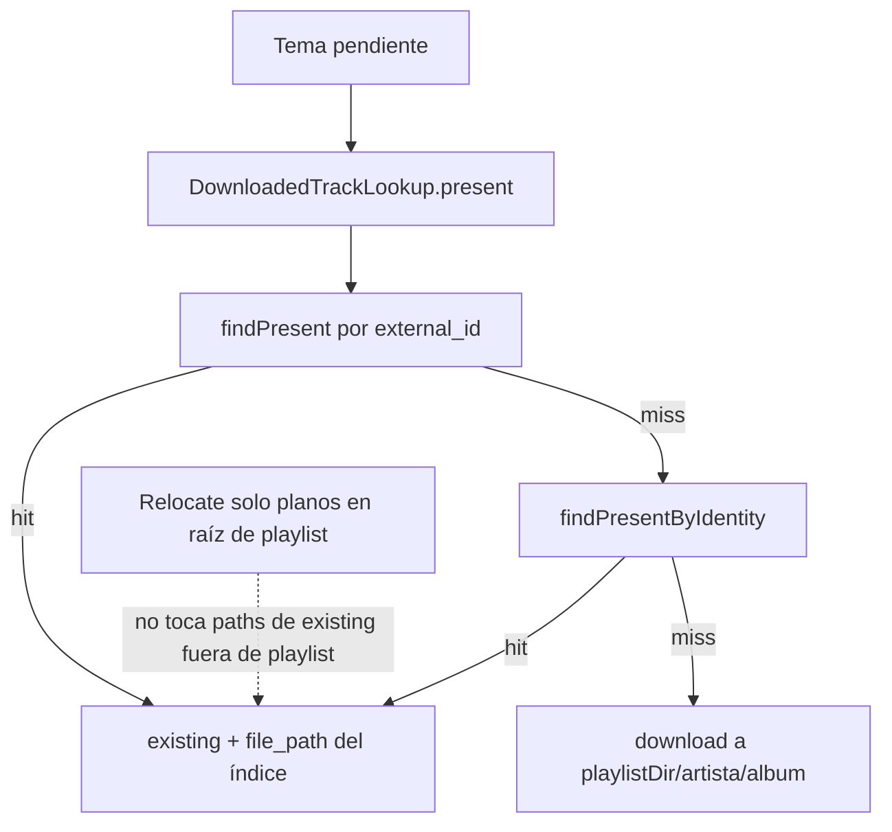
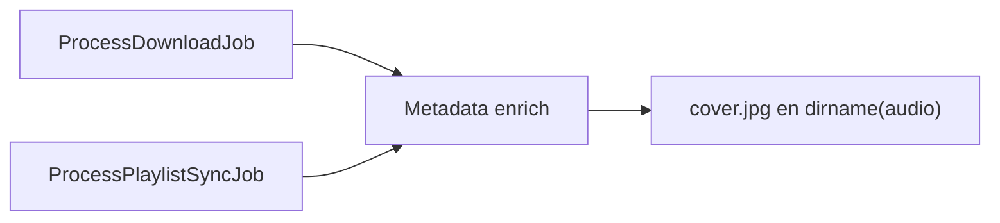

# Carpetas por álbum dentro de la playlist

## Contexto (local + épica)

La épica [`.cursor/plans/playlist_cover_modes_3733c473.plan.md`](.cursor/plans/playlist_cover_modes_3733c473.plan.md) ya está implementada en local:

- En la raíz de la playlist: `{id}-{slug}.m3u` + `{id}-{slug}.jpg` (portada de la playlist; Navidrome usa ese sidecar).
- Streamrip tiene `save_artwork = false` y `embed = true` en [`StreamripDeezerDownloader`](backend/app/Infrastructure/Providers/Deezer/StreamripDeezerDownloader.php).

Hoy el sync baja todo plano a `playlists/{id-slug}/` con `playlistTrackFilename`. La épica añadió [`removeGenericArtwork`](backend/app/Application/PlaylistCover/PlaylistCoverGenerator.php) para borrar un `cover.jpg` suelto en la **raíz** cuando streamrip lo dejaba ahí. Con el layout anidado ese problema deja de existir: **eliminar `removeGenericArtwork`** y su llamada en `prepareOutput`.

El mosaico de cover modes **no** depende del layout: lee `file_path` y carátulas embebidas.

La épica [`.cursor/plans/match_tracks_by_identity_48400663.plan.md`](.cursor/plans/match_tracks_by_identity_48400663.plan.md) **sigue vigente** y no se toca su lógica de negocio. Este layout solo cambia **dónde** se escribe un tema cuando hay que bajarlo de nuevo; no cambia **cuándo** se reutiliza uno ya indexado.

## Preservar match por identidad (no regresión)

Comportamiento que **debe mantenerse** tal como está implementado:

1. En cada tema pendiente del sync, **antes** de `download`, [`DownloadedTrackLookup::present`](backend/app/Application/IndexDownloadedTracks/DownloadedTrackLookup.php):
   - Primero `findPresent(user, provider, external_id)`.
   - Si null → `findPresentByIdentity(user, artist, title, releaseYear)` con las reglas de la épica (un hit reutiliza aunque el año difiera; varios hits desempatan por `release_year`; artista vacío no entra).
2. Si hay hit: status `existing`, `file_path` del índice **sin modificar** (puede ser `/music/artista/album/...` fuera del árbol de la playlist), **no** llamar a `download`, **no** crear segunda fila en `downloaded_tracks` para el id de la edición de la playlist.
3. El M3U sigue apuntando a ese path ([`PlaylistM3uWriter::relativeFrom`](backend/app/Infrastructure/Storage/PlaylistM3uWriter.php) con `../` si hace falta).
4. [`ProcessDownloadJob`](backend/app/Jobs/ProcessDownloadJob.php) para álbumes sueltos: sigue matcheando solo por id de provider (la épica identity es **solo** sync de playlists).

**Interacción con layout y relocate:**

- El relocate de planos aplica **solo** a audios cuyo `file_path` está **dentro** de la carpeta de la playlist y es un archivo **directo en la raíz** (layout viejo). No mueve ni copia archivos reutilizados por identidad que viven en `/music/...`.
- Cambiar `musicPath` / quitar `targetDirectory` **no** debe ejecutarse en el branch de `existing`: ahí no hay descarga ni enrich en la carpeta de la playlist.
- Nuevas descargas del sync (sin hit) van a `playlists/.../artista/album/` y hacen `upsert` en el índice como hoy.



## Flujo de `cover.jpg` (único mecanismo)

Tras enrich (bytes de `cover_xl` / embed), escribir `cover.jpg` en **`dirname($audioPath)`** — la carpeta del álbum donde quedó el archivo. No en la raíz de la playlist. No reactivar `save_artwork` de streamrip.

| Origen | Carpeta del audio | `cover.jpg` |
|--------|-------------------|-------------|
| Descarga convencional (álbum / track en biblioteca) | `{musicPath}/artista/album/` | `{musicPath}/artista/album/cover.jpg` |
| Sync o descarga de playlist | `playlists/{id}-{nombre}/artista/album/` | `playlists/{id}-{nombre}/artista/album/cover.jpg` |

Reglas:

- Si la carpeta de álbum ya tiene un `cover.jpg` válido, no reescribir (varios temas del mismo álbum).
- La raíz de la playlist **nunca** recibe `cover.jpg`; solo `{id}-{slug}.jpg` de cover modes.

Implementación: helper compartido invocado desde [`ApplyTrackMetadataHandler`](backend/app/Application/Metadata/ApplyTrackMetadataHandler.php) (o inmediatamente después del writer) en **cualquier** descarga Deezer con enrich — [`ProcessDownloadJob`](backend/app/Jobs/ProcessDownloadJob.php) y [`ProcessPlaylistSyncJob`](backend/app/Jobs/ProcessPlaylistSyncJob.php).

## Layout objetivo (playlist)

```text
playlists/{id}-{slug}/
  {id}-{slug}.m3u
  {id}-{slug}.jpg          # cover modes (épica)
  artista/
    album/
      01 - titulo.flac
      cover.jpg
```



## Cambios

### 1. Destino de descarga del sync

En [`ProcessPlaylistSyncJob::buildOptions`](backend/app/Jobs/ProcessPlaylistSyncJob.php):

- `musicPath` = `$playlistDir`.
- `targetDirectory` = `null`.

[`DeezerProvider`](backend/app/Infrastructure/Providers/Deezer/DeezerProvider.php) / [`YoutubeMusicProvider`](backend/app/Infrastructure/Providers/YoutubeMusic/YoutubeMusicProvider.php) → `trackDirectory` + `trackFilename` bajo la playlist.

Dejar de forzar `withPlaylistPosition` para el nombre de archivo: usar `track_position` de Deezer. Orden de playlist solo en el M3U.

`playlistLayout` / `playlistTrackFilename` dejan de usarse en el sync (matcher legacy para planos viejos).

### 2. Quitar `removeGenericArtwork`

En [`PlaylistCoverGenerator`](backend/app/Application/PlaylistCover/PlaylistCoverGenerator.php): eliminar `removeGenericArtwork` y la llamada en `prepareOutput`. Actualizar [`PlaylistCoverGeneratorTest`](backend/tests/Unit/PlaylistCoverGeneratorTest.php) (hoy espera que se borre `cover.jpg` en la raíz).

### 3. Reubicar archivos planos existentes

Al inicio del sync (después de `resolve` + `playlistDir`, antes del loop de pendientes), para cada tema cuyo `file_path` sea audio **directo** bajo la raíz de esa playlist:

1. Artista/álbum del `Track` resuelto.
2. Mover a `{playlistDir}/{artist}/{album}/{NN} - {title}.{ext}`.
3. Asegurar `cover.jpg` en esa carpeta (embed o enrich).
4. Actualizar `file_path` en `saved_playlist_tracks` y `downloaded_tracks`.

No mover temas reutilizados fuera de la playlist (paths de `existing` por identidad quedan en `/music/...`).

### 4. Delete y M3U

Sin cambios de reglas: [`DeleteSavedPlaylistHandler`](backend/app/Application/DeleteSavedPlaylist/DeleteSavedPlaylistHandler.php) (solo borra archivos bajo el árbol de la playlist; reutilizados en biblioteca no se tocan), [`PlaylistM3uWriter`](backend/app/Infrastructure/Storage/PlaylistM3uWriter.php).

### 5. Tests

- **No regresión identity:** mantener verdes los casos de [`ProcessPlaylistSyncJobTest`](backend/tests/Unit/ProcessPlaylistSyncJobTest.php) (`test_sync_reuses_track_by_identity_when_provider_id_differs`, homónimos con otro año descargan, etc.) y [`DownloadedTrackIndexTest`](backend/tests/Feature/DownloadedTrackIndexTest.php) / repositorio.
- Tras cambios de layout: identity hit sigue sin `download`, M3U con ruta relativa hacia biblioteca.
- `ProcessDownloadJob` / enrich: `cover.jpg` en `/music/artista/album/`.
- Sync descarga nueva: audio + `cover.jpg` bajo `playlistDir/artist/album/`; raíz sin `cover.jpg`.
- Relocate: solo planos en raíz de playlist; sidecar `{id}-{slug}.jpg` intacto.

### 6. Fuera de alcance

- No reactivar `save_artwork` de streamrip.
- No copiar temas reutilizados dentro de la playlist.
- Embeds faltantes: `downloads:repair-covers` (opcionalmente extender repair para escribir `cover.jpg` en carpeta del álbum si falta).
