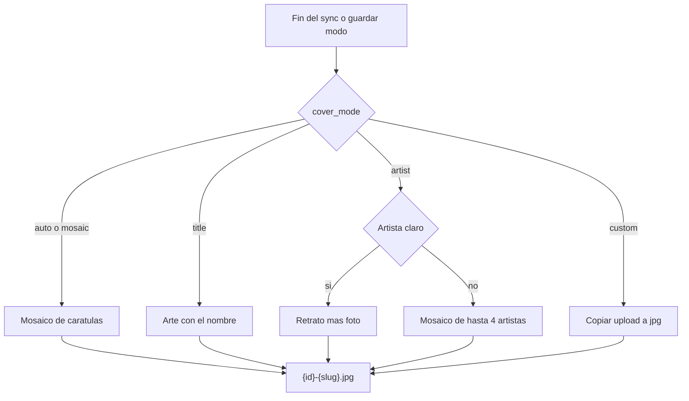

# Portadas de playlists

Navidrome arma el mosaico 2×2 porque el sync solo escribe el `.m3u`. Al cerrar cada sync, y al guardar el modo en la playlist, se escribe `{id}-{slug}.jpg` junto a `{id}-{slug}.m3u` en la carpeta que ya calcula [`LocalMusicStorage::playlistDirectory`](backend/app/Infrastructure/Storage/LocalMusicStorage.php). Navidrome usa esa imagen (mismo nombre que el playlist) y deja de inventar la portada.

## Modos

Columna `cover_mode` en `saved_playlists`, default `auto`. Valores: `auto`, `mosaic`, `title`, `artist`, `custom`.

- **Automático:** siempre el mosaico de temas.
- **Mosaico de temas:** carátulas embebidas en los archivos ya descargados (mutagen). Se deduplica por bytes de la imagen y se toman hasta 4 distintas, en orden de la playlist. 1 ocupa todo el cuadrado; 2, mitades; 3, una grande y dos chicas; 4, grilla. No se repite la misma carátula.
- **Arte con el nombre:** cuadrado con degradado estable (hash del id) y el título. Fuente DejaVu, para que entren tildes.
- **Retrato:** se cuenta el artista principal guardado en `saved_playlist_tracks.artist` (se ignora vacío y `Unknown Artist`). Hay uno claro si tiene al menos 3 temas y más que el segundo; si es el único artista, también es claro. Se busca en Deezer (`search/artist`, API pública, sin ARL) y se usa `picture_xl`. La foto llena el cuadrado, oscurecida abajo, con el título de la playlist arriba. Sin el logo de Deezer. Si no hay uno claro, mosaico con las fotos de los 4 que más aparecen (mismo layout 1/2/3/4 si hay menos fotos). Si no hay ninguna foto, se escribe el arte del nombre.
- **Imagen propia:** el usuario sube JPEG, PNG o WebP. Se recorta al centro, se pasa a JPEG de 1000 px y se guarda en storage privado (`playlist-covers/{id}.jpg`). El sync solo copia ese archivo al JPG de la carpeta; no lo regenera. Si el slug del título cambia, la copia sigue el directorio nuevo.

Si el modo es mosaico o automático y todavía no hay ninguna carátula embebida, se escribe el arte del nombre para que la playlist no quede sin imagen. El sync siguiente lo reemplaza cuando haya temas con portada.

Un fallo al renderizar no falla el sync: se loguea y el `.m3u` sigue igual.

## Backend

- Migración `cover_mode` (string, default `auto`).
- [`EloquentSavedPlaylistRepository::update`](backend/app/Infrastructure/Persistence/EloquentSavedPlaylistRepository.php) acepta el campo. [`SavedPlaylistResource`](backend/app/Http/Resources/SavedPlaylistResource.php) lo devuelve, más `cover_url` apuntando a la ruta de abajo.
- `PlaylistCoverGenerator` (aplicación): elige imágenes según el modo y llama a un script Python. Se invoca al final de [`ProcessPlaylistSyncJob::regenerateM3u`](backend/app/Jobs/ProcessPlaylistSyncJob.php) y al guardar el modo, sin esperar al próximo sync.
- Script [`docker/scripts/render-playlist-cover.py`](docker/scripts/render-playlist-cover.py): Pillow compone el JPEG 1000×1000. Extrae APIC/pictures con mutagen para el mosaico. En el Dockerfile, sumar `pillow` al `pip install` y `fonts-dejavu-core` al `apt-get`.
- `POST /api/playlists/{id}/cover` (multipart, dueño de la playlist, igual que el update): valida tipo y tamaño (hasta 8 MB), fija `cover_mode=custom` y escribe los dos JPEG.
- `GET /api/playlists/{id}/cover`: devuelve el JPEG para la vista previa del modal. Misma visibilidad que el show.
- Al borrar la playlist, [`DeleteSavedPlaylistHandler`](backend/app/Application/DeleteSavedPlaylist/DeleteSavedPlaylistHandler.php) ya borra la carpeta; además borrar el archivo de storage privado.

## UI

En el modal de configuración de [`playlist-detail.component`](frontend/src/app/pages/playlist-detail/playlist-detail.component.html), un selector **Portada**:

- Automático (mosaico de temas)
- Mosaico de temas
- Arte con el nombre
- Retrato del artista
- Imagen propia

Vista previa con `GET .../cover`. En imagen propia, input de archivo (el mismo patrón `FormData` de las cookies) y, si ya hay una, botón para volver a automático. Guardar el modo dispara el render y refresca la preview.

## Tests

- Ranking: un artista claro contra empate que cae en los 4.
- Mosaico: dos archivos con la misma carátula cuentan como una.
- Upload: queda en `custom` y un sync posterior no pisa el JPEG guardado.
- Script Python: título con tilde entra en el cuadrado; 1 imagen no se cuadriplica.
