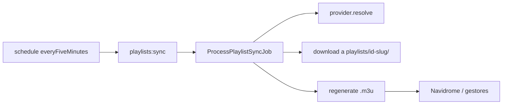

# Playlists en disco + M3U + sync reactivo (5 min)

Decisiones cerradas: **1A** (solo sync de playlists guardadas) y **2A** (polling ~5 min + regenerar M3U).

## Contexto

Hoy [`LocalMusicStorage`](app/Infrastructure/Storage/LocalMusicStorage.php) escribe `{MUSIC_PATH}/{artist}/{album}/…` para todo. [`ProcessPlaylistSyncJob`](app/Jobs/ProcessPlaylistSyncJob.php) reutiliza `provider->download()` sin carpeta de playlist. No hay generación M3U. El scheduler corre `playlists:sync` **hourly** con `sync_interval_hours` default 24.

**Realtime remoto:** Deezer y YouTube Music no exponen webhooks/WebSocket públicos de “track agregado a playlist”. Un WebSocket propio solo notificaría a la UI cuando *nosotros* terminamos un job; no acelera la detección del cambio remoto. La aproximación viable es **pull frecuente**.

## 1. Layout en disco (solo sync de playlists)

**Destino:** `{MUSIC_PATH}/playlists/{id}-{slug}/`

- `slug` = `Str::slug(title)` o `playlist` si aún no hay título; el **id** fija la carpeta (estable ante renames de título).
- Archivos: `{position:02d} - {artist-slug} - {title-slug}.{ext}` (evita colisiones entre artistas).
- One-shot (`ProcessDownloadJob` / browse “Descargar ahora”) **sin cambios**: sigue artista/álbum.

**Cómo enrutar el path sin romper providers:**

- Extender [`DownloadOptions`](app/Domain/Music/ValueObjects/DownloadOptions.php) con `?string $targetDirectory = null`.
- En YouTube/Deezer download: si `targetDirectory` está set, usarlo en vez de `LocalMusicStorage::trackDirectory()`.
- En el job de sync: calcular `playlistDirectory` y pasar `targetDirectory` en `buildOptions()`.
- Añadir helpers en `LocalMusicStorage`: `playlistDirectory(int $id, ?string $title)`, `playlistTrackFilename(...)`.

Tras cada track OK, `file_path` en DB apunta al path bajo `playlists/…` (como hoy).

## 2. Generación / actualización de M3U

Nuevo servicio p.ej. [`PlaylistM3uWriter`](app/Infrastructure/Storage/PlaylistM3uWriter.php):

- Escribe `{playlistDir}/{id}-{slug}.m3u` (mismo dir que los audio).
- Formato extended: `#EXTM3U`, `#PLAYLIST:{title}`, `#EXTINF:duration,Artist - Title`, luego **ruta relativa** al archivo (solo el basename) — compatible con Navidrome e import en gestores.
- Orden = `position` de tracks con status `downloaded` y `file_path` existente.
- Tracks `skipped`/`failed`/`pending` no entran.
- Llamar **después de cada track descargado con éxito** y **al final del sync** (así un sync largo ya es usable a mitad de camino).

Sin migración de librería existente (archivos viejos en artista/álbum quedan; el próximo sync de pending nuevos ya usa el layout nuevo; no reubicar downloaded previos en v1).

## 3. Sync “reactivo” vía polling 5 min

- Migración: renombrar semántica de intervalo a **minutos**.
  - Columna `sync_interval_hours` → `sync_interval_minutes` (o nueva columna + drop de la vieja).
  - Default **5**; validación API/UI `min:1`, `max:10080` (7 días).
  - Convertir filas existentes: `hours * 60` (24 → 1440).
- [`listDueForSync`](app/Infrastructure/Persistence/EloquentSavedPlaylistRepository.php): comparar `last_synced_at + minutes`.
- [`routes/console.php`](routes/console.php): `Schedule::command('playlists:sync')->everyFiveMinutes()`.
- Config/settings: `default_sync_interval_minutes` (env), default 5; actualizar save playlist + settings UI/API.
- Detalle Angular: label “cada N min”, input en minutos; default form 5.

## 4. Docs + tests

- README / nota Navidrome: apuntar la librería a `{MUSIC_PATH}` (o a `playlists/`); el `.m3u` dentro de cada carpeta se importa/watch como playlist.
- Dejar explícito: **no hay push remoto**; el “inmediato” es “en el próximo poll ≤ ~5 min” (+ cola worker).
- Tests:
  - Unit: path helpers + M3U contenido (orden, relative paths, EXTINF).
  - Feature/Unit sync job: download usa `targetDirectory` bajo `playlists/`; M3U regenerado.
  - `SyncPlaylistsCommand` / due logic con minutos.
  - Request validation minutos.

## Fuera de alcance

- WebSocket/SSE hacia el frontend (opcional más adelante solo para progreso de sync local).
- Reubicar archivos ya descargados bajo artista/álbum.
- Hardlinks / dedupe cross-playlist.
- Cambiar layout de descargas one-shot.
