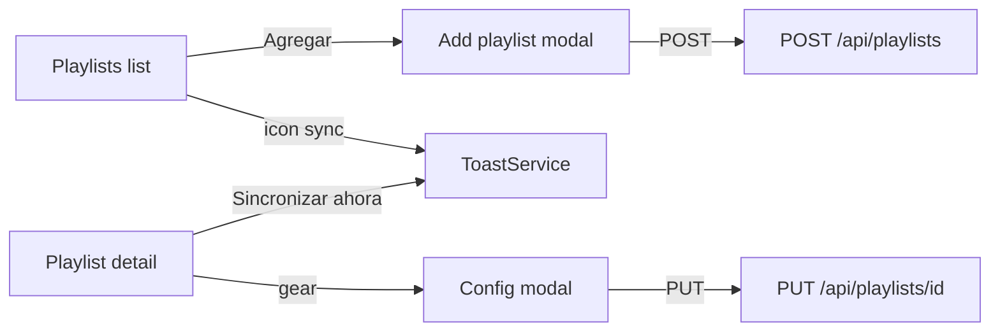

# Playlists UI: iconos, toast, modales y paginación

Sin librería nueva de iconos ni toasts: SVGs inline compartidos + `ToastService` liviano. Paginación **client-side** (API ya trae listas completas).

## Alcance por pantalla

### Listado [`playlists.component`](frontend/src/app/pages/playlists/)

- Botón **Agregar playlist**: icono `+` + texto; abre **modal** (no form inline).
  - Campos: URL, checkbox sync ahora, Guardar / Cancelar / X / Escape / backdrop.
- Tabla:
  - Columnas: **Playlist | Provider | Sync | Tracks | Acciones**.
  - Playlist: título + “Último sync” debajo; **sin URL**.
  - Provider y Sync en columnas propias (badge).
  - Acciones en fila, **solo icono**: sync (refresh), detalle (eye), borrar (trash). Sync con spinner + disabled; toast al encolar.
  - Delete: confirm + `DELETE /api/playlists/{id}`.
- Paginación: page size `10|20|30|40|50` (default 10) + prev/next.

### Detalle [`playlist-detail.component`](frontend/src/app/pages/playlist-detail/)

- Header:
  - **Título + badge de estado sync (OK / …) en la misma fila** (sin margen extra entre título y meta).
  - Debajo: provider · counts · último sync (una sola línea).
  - Sin URL en el header.
- Acciones:
  - **Sincronizar ahora**: texto + icono refresh; toast + disabled/spinner.
  - **Configuración**: icono **engranaje sólido** (Material-style, teeth + agujero; no “sol”).
  - **Eliminar**: icono trash.
- Config en **modal**: URL readonly, sync_enabled, intervalo minutos, formato, Guardar; Escape/backdrop/X.
- Tracks: paginación client-side 10–50.

## Componentes / utilidades

| Pieza | Rol |
|-------|-----|
| [`toast.service.ts`](frontend/src/app/shared/toast.service.ts) + host en [`app.component`](frontend/src/app/app.component.html) | `success` / `error` auto-dismiss |
| [`icon.component.ts`](frontend/src/app/shared/icon.component.ts) | `plus`, `refresh`, `eye`, `trash`, `gear` (filled cog), `spinner`, `x` |
| [`pagination.component.ts`](frontend/src/app/shared/pagination.component.ts) | barra reutilizable |
| [`styles.css`](frontend/src/styles.css) | `.btn-icon`, `.modal-*`, `.toast-*`, `.pagination` |

## Comportamiento sync

- `syncNow()` / `sync()`: flag → toast success al encolar → clear en `next`/`error`; error también toast.
- Disabled si `syncing` **o** `last_sync_status === 'running'`.

## Iteraciones post-plan inicial (ya aplicadas / en curso)

1. Provider y Sync como **columnas separadas** (no bajo el título).
2. Badge OK **al lado del título** en detalle; meta en una línea; márgenes del h1 corregidos.
3. Icono gear = **cog sólido** (no rayos tipo sol).
4. **Agregar playlist en modal** (este todo).

## Fuera de alcance

- Paginación server-side / cambios de API.
- Editar URL de playlist.
- WebSockets para progreso de sync.
