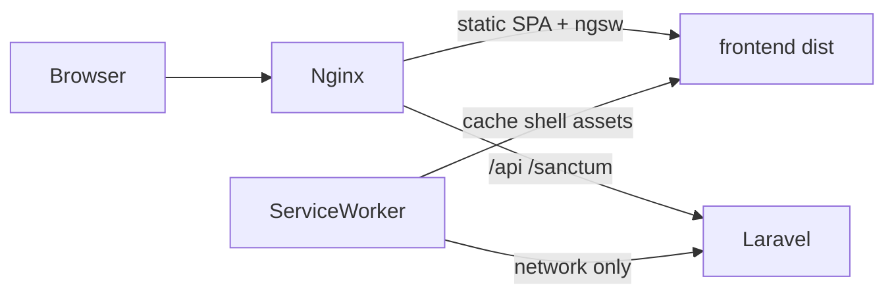

# Responsive + PWA instalable

## Alcance

- **Responsive:** cerrar gaps en pantallas densas (tablas, filas de hits, auth register, users) reusando el shell móvil ya existente (drawer ≤840px).
- **PWA:** instalable (`standalone`) + cache del app shell vía `@angular/service-worker`. **No** cachear `/api` ni `/sanctum`; sin modo offline de catálogo/descargas.
- **Orden:** primero CSS/layout; después PWA (manifest, iconos, SW, nginx).

## Parte 1 — Responsive

Breakpoints a consolidar (ya en uso):

- `≤840px` — shell (drawer + `mobile-bar`)
- `≤640px` — páginas de contenido (tablas → stack, hits wrap)
- `≤560px` — polish auth topbar (ya hecho)

### Shell

En [`frontend/src/app/app.component.css`](frontend/src/app/app.component.css) y [`frontend/src/styles.css`](frontend/src/styles.css):

- `env(safe-area-inset-*)` en `mobile-bar`, sidebar drawer y padding inferior del contenido
- Touch targets ≥44px en hamburger / cierre / icon buttons del rail móvil

### Tablas → layout apilado (alta prioridad)

Hoy solo hacen `overflow-x: auto`. En `≤640px`, pasar a filas tipo card (label + valor) sin romper el HTML de desktop:

- [`downloads.component.css`](frontend/src/app/pages/downloads/downloads.component.css) + HTML si hace falta `data-label` en celdas
- [`playlists.component.css`](frontend/src/app/pages/playlists/playlists.component.css) — quitar `nowrap` forzado en actions bajo móvil
- [`playlist-detail.component.css`](frontend/src/app/pages/playlist-detail/playlist-detail.component.css) — misma idea; toolbar de sync/gear/trash a full-width wrap

Patrón: `thead { display: none }`, cada `tr` como bloque, `td::before { content: attr(data-label) }` o grid de columnas ocultando secondary info.

### Filas de catálogo / colección

- Replicar en Collection el wrap ≤640 de Browse ([`browse.component.css`](frontend/src/app/pages/browse/browse.component.css) L168–177) en [`collection.component.css`](frontend/src/app/pages/collection/collection.component.css)
- Browse search: apilar provider + query + submit de forma más limpia bajo 640
- Browse artist/playlist: toolbars/chips con wrap + gap; sin rediseño visual

### Resto (media)

- **Users:** [`users.component.css`](frontend/src/app/pages/users/users.component.css) — `user-card` en columna bajo 640 (meta arriba, actions abajo)
- **Register:** [`auth-page.css`](frontend/src/app/pages/auth/auth-page.css) — avatar grid `repeat(6)` → `repeat(4)` / `repeat(3)` en breakpoints chicos
- Settings / login / album: sin cambios estructurales (ya OK)

## Parte 2 — PWA

### Wiring Angular

1. Añadir `@angular/service-worker` y configurar producción con `ngsw-config.json` (equivalente a schematic `@angular/pwa`).
2. En [`app.config.ts`](frontend/src/app/app.config.ts): `provideServiceWorker('ngsw-worker.js', { enabled: !isDevMode(), registrationStrategy: 'registerWhenStable:30000' })`.
3. [`angular.json`](frontend/angular.json): `serviceWorker` + `ngswConfigPath` solo en config `production`.
4. Manifest en `frontend/public/manifest.webmanifest` (name, short_name, `display: standalone`, `start_url: "/"`, theme/background alineados a `--accent` / `--bg`).
5. Link en [`index.html`](frontend/src/index.html): manifest + `theme-color`.
6. Iconos desde `frontend/public/logo.png` (1024²): generar `icons/icon-192.png`, `icon-512.png` y variantes maskable; referenciarlos en el manifest. Mantener `apple-touch-icon`.

### `ngsw-config.json` (política fija)

- **Prefetch:** `index.html`, JS/CSS hashed, iconos, logo
- **Lazy:** fuentes remotas solo si siguen en Google Fonts (o dejar network)
- **Data groups:** ninguno para API — las peticiones a `/api/**` y `/sanctum/**` no entran en el asset group (paths de la app = estáticos bajo `/`)
- Sin `navigationUrls` agresivos que interfieran con Laravel; el SPA ya lo resuelve nginx con `try_files`

### Update UX mínima

Servicio pequeño que escuche `SwUpdate.versionUpdates` y muestre un toast existente ([`toast.service.ts`](frontend/src/app/shared/toast.service.ts)) tipo “Hay una nueva versión — recargar”, con acción de `activateUpdate()` + reload. Sin banner de “Instalar app” custom (instalación nativa del browser).

### Nginx

En [`docker/nginx/default.conf`](docker/nginx/default.conf):

- Servir `manifest.webmanifest` con `application/manifest+json` si hace falta
- `Cache-Control: no-cache` para `index.html` y `ngsw.json` / `ngsw-worker.js` para que las updates del SW no queden pegadas detrás de un cache agresivo (hoy no hay headers de cache; fijar explícitamente para esos archivos)
- Resto de assets hashed: cache largo opcional; no bloqueante para v1

### HTTPS / instalación

- Installability requiere **secure context** (HTTPS o localhost). En Synology con reverse proxy HTTPS funciona; en `:8085` HTTP local la instalación puede no ofrecerse — esperado, documentar en cierre de feature / `PROJECT_CONTEXT.md`.

## Fuera de alcance

- Offline de API, cola de descargas, o cache de audio
- Push notifications
- Bottom tab bar móvil (el drawer actual alcanza)
- Rediseño visual / nuevo design system

## Verificación (sin browser automation)

- Build production del frontend (`ng build`) y comprobar que salen `ngsw-worker.js`, `ngsw.json`, manifest e iconos en `dist`
- Rebuild compose dev al cerrar feature (rule de cierre)
- Checklist manual para el usuario: viewport &lt;640 en Downloads/Playlists/Collection; DevTools → Application → Manifest + SW en build prod detrás de HTTPS
