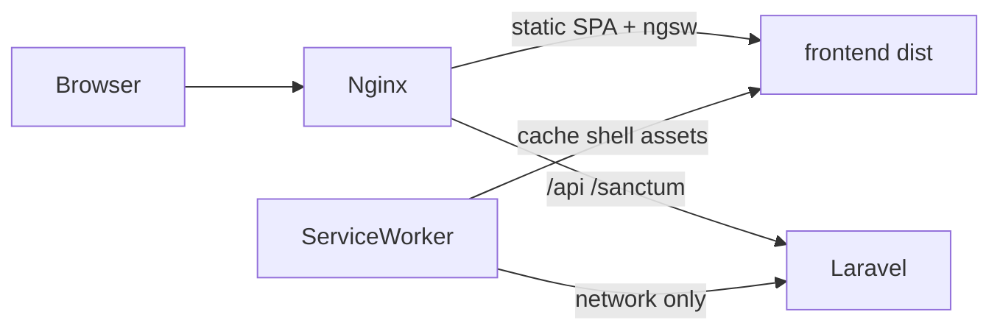

# Responsive + PWA instalable

Hecho. Commits `3eff482` (PWA + layout) y `4981fcc` (botón único de nueva descarga).

## Alcance que quedó

- **Responsive:** shell drawer ≤840px, contenido ≤640px. En móvil las tablas son cards y las acciones de fila son iconos a la derecha, no botones con texto debajo.
- **PWA:** instalable (`standalone`) + cache del app shell vía `@angular/service-worker`. No cachea `/api` ni `/sanctum`. Sin offline de catálogo ni descargas.
- **Instalar:** contexto seguro. `http://localhost:8085` alcanza en la Mac. En el NAS, HTTPS de Tailscale en un puerto distinto del 443 (`https://nas.<tailnet>.ts.net:8443` → `127.0.0.1:8085`) para no pisar Vaultwarden. `ng serve` (`:4200`) no registra el service worker. El worker se registra al estabilizar la app o a los 30 s; hace falta recargar una vez para que Chrome ofrezca instalar.

## Parte 1 — Responsive

Breakpoints:

- `≤840px` — shell (drawer + `mobile-bar`, safe-area, targets ≥44px)
- `≤640px` — cards, iconos de acción, página de discografía en 6
- `≤560px` — auth topbar (ya estaba)

### Cards de tablas (≤640px)

`thead` oculto, cada `tr` en grid. La celda de título ocupa la columna izquierda; las acciones van en la columna derecha, arriba. El resto de celdas llevan `data-label` y ocupan el ancho completo. El valor no se estira a todo el ancho (`justify-self: start`). La barra de progreso y el porcentaje van en la misma fila (`.progress-readout`).

- Descargas: tachito arriba a la derecha.
- Playlists guardadas: sincronizar, ver y borrar arriba a la derecha.
- Detalle de playlist: filas apiladas; la toolbar de sync envuelve.

### Filas de Explorar y Mi Colección (≤640px)

No bajan a una segunda línea. Quedan a la derecha de la fila, solo icono:

- Descargar (el texto del botón se oculta dentro de `.hit`).
- Estrella de favorito del artista.
- Sincronizar + descargar en las playlists del proveedor.

La búsqueda de Explorar apila provider, query y submit. La grilla de avatares del registro pasa a 4 y luego a 3 columnas. Usuarios apila meta y acciones. La discografía del artista usa 12 ítems por página en desktop y 6 en móvil (`matchMedia` en `browse-artist`).

### Botones de alta

Un solo botón en el encabezado. El del estado vacío se sacó (Playlists y Descargas).

- Escritorio: “Agregar playlist” y “Nueva descarga” con texto.
- Celular: solo el “+”, a la derecha del título.
- “Nueva descarga” va antes que “Vaciar historial”. En el celular, vaciar es solo el tachito; en escritorio conserva el texto.

Toasts centrados abajo, no anclados a la derecha.

## Parte 2 — PWA

- `@angular/service-worker` solo en el build de producción (`angular.json` → `serviceWorker: ngsw-config.json`).
- `provideServiceWorker('ngsw-worker.js', { enabled: !isDevMode(), registrationStrategy: 'registerWhenStable:30000' })`.
- `frontend/public/manifest.webmanifest` (`display: standalone`, theme `#008ace`, background `#f8fafc`) + iconos 192/512 y maskable, generados desde `logo.png`.
- `ngsw-config.json`: prefetch del shell; avatars lazy; `navigationUrls` excluye `/api/**`, `/sanctum/**` y `/up`. Sin data groups.
- `AppUpdateService` escucha `VERSION_READY` y muestra el toast “Hay una nueva versión.” con acción Recargar (`activateUpdate` + reload).
- Nginx: `Cache-Control: no-cache` en `index.html`, `ngsw.json`, `ngsw-worker.js` y `manifest.webmanifest` (`application/manifest+json`).
- Budget de estilos del shell subido a 12 kB de error y el bundle inicial a 600 kB de warning, porque el CSS del layout y el service worker los pasaban.

## Fuera de alcance

- Offline de API, cola de descargas o cache de audio
- Push notifications
- Bottom tab bar
- Banner propio de “Instalar app”
