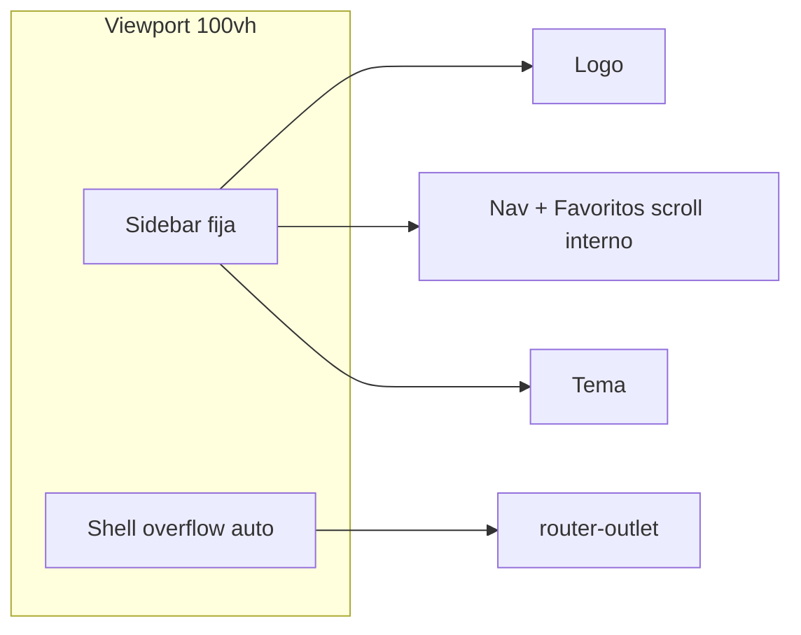

# Sidebar fijo y colapsable

## Problema

En [`frontend/src/app/app.component.css`](frontend/src/app/app.component.css) el layout usa `min-height: 100vh` y el sidebar `position: sticky` + `min-height: 100vh`. Cuando el body crece, el flex también estira el sidebar. El scroll es de la página entera, no del contenido.

## Enfoque

Shell de viewport fijo + sidebar colapsable a íconos (desktop). En mobile se mantiene el overlay actual.

## 1. Layout: solo el body scrollea

En [`app.component.css`](frontend/src/app/app.component.css) (y tokens mínimos en [`styles.css`](frontend/src/styles.css) si hace falta):

- `.layout`: `height: 100vh` (o `100dvh`), `overflow: hidden` — deja de crecer con el contenido.
- `.sidebar`: `height: 100%`, quitar `min-height: 100vh` y `sticky`; en desktop queda en el flujo flex a altura fija.
- `.nav`: `overflow-y: auto` (ya tiene `flex: 1` + `min-height: 0`) para que muchos favoritos no empujen el footer.
- `.shell`: `flex: 1`, `min-height: 0`, `overflow: auto` — ahí ocurre el scroll.
- Asegurar que `html`/`body`/`app-root` no generen un segundo scroll (p.ej. `height: 100%` en `app-root` o `overflow: hidden` en `body`).

Mobile (`max-width: 840px`): el sidebar sigue `position: fixed` overlay; el scroll sigue siendo del `.shell`.

## 2. Colapso desktop (rail de íconos)

Estado en [`app.component.ts`](frontend/src/app/app.component.ts):

- `sidebarCollapsed` con persistencia `localStorage` (`mh-sidebar-collapsed`), mismo patrón que [`ThemeService`](frontend/src/app/core/theme.service.ts).
- Clase en el layout: `[class.sidebar-collapsed]="sidebarCollapsed"`.
- Toggle solo visible en desktop (junto al brand); en mobile no aplica — el menú overlay sigue igual.

CSS colapsado (`--sidebar-width-collapsed: ~3.75rem`):

- Ancho reducido; ocultar `.brand-text`, labels de nav (`span` de ítems), título “Favoritos”, texto vacío y label del theme toggle.
- Ítems centrados (solo ícono / cover); `title` / `aria-label` con el nombre para accesibilidad.
- Transición suave de `width` (~0.2s).
- Ícono nuevo en [`icon.component.ts`](frontend/src/app/shared/icon.component.ts): p.ej. `panel-left` o chevrons para el botón expandir/colapsar.

Markup en [`app.component.html`](frontend/src/app/app.component.html): botón de colapso en `.sidebar-top` (desktop); favoritos y nav items ya tienen ícono/cover, así que el colapso es mayormente CSS + labels ocultos.

## Archivos a tocar

- [`frontend/src/app/app.component.css`](frontend/src/app/app.component.css) — layout viewport + estilos collapsed
- [`frontend/src/app/app.component.html`](frontend/src/app/app.component.html) — toggle + clases + titles
- [`frontend/src/app/app.component.ts`](frontend/src/app/app.component.ts) — estado collapse + localStorage
- [`frontend/src/app/shared/icon.component.ts`](frontend/src/app/shared/icon.component.ts) — ícono del toggle
- [`frontend/src/styles.css`](frontend/src/styles.css) — `--sidebar-width-collapsed` y lock de scroll en root/body si hace falta

## Verificación (sin browser)

Tras implementar: build del frontend si hace falta. Revisar en desktop: página larga (p.ej. artista con muchos álbumes) — sidebar a 100vh, scroll solo en el main; colapsar/expandir y recargar para confirmar persistencia. En mobile: menú overlay sin cambios de comportamiento.