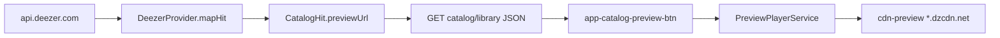

# Preview snip de tracks (Deezer)

## Objetivo

Permitir **tantear** si un track es el correcto antes de descargar o destacar, reproduciendo el preview oficial de Deezer (~30s MP3). No es un reproductor: sin cola, seek, ni barra global.

## Enfoque

Deezer ya envía `preview` en `api.deezer.com`. Hoy se descarta en [`mapHit`](backend/app/Infrastructure/Providers/Deezer/DeezerProvider.php). Se expone como `preview_url` en el API de catálogo/biblioteca y el frontend lo reproduce con `<audio>` vía un servicio singleton.

**Fuera de alcance:** YouTube Music, playlists guardadas (`playlist-detail`), proxy de audio, barra tipo Spotify, refactor grande de hit-row.

## Backend

1. Extender [`CatalogHit`](backend/app/Domain/Music/ValueObjects/CatalogHit.php) con `?string $previewUrl = null`.
2. En [`DeezerProvider::mapHit`](backend/app/Infrastructure/Providers/Deezer/DeezerProvider.php): si `$row['preview']` es string no vacía, asignarla.
3. Serializar en [`CatalogResource::hit`](backend/app/Http/Resources/CatalogResource.php) como `preview_url`.
4. Actualizar [`CatalogApiTest`](backend/tests/Feature/CatalogApiTest.php) (y library si aplica) con fixture `preview` y assert de `preview_url`.

Sin endpoint nuevo: el URL del CDN va en cada hit de track.

## Frontend

1. Modelo: `preview_url: string | null` en [`CatalogHit`](frontend/src/app/core/models.ts).
2. **`PreviewPlayerService`** (`frontend/src/app/core/preview-player.service.ts`):
   - Un solo `HTMLAudioElement`.
   - API: `toggle(url)`, `stop()`, signal `playingUrl`.
   - Al tocar otro track, para el anterior; al terminar el clip, limpia estado.
3. **`app-catalog-preview-btn`** (mismo estilo que [`catalog-download-button`](frontend/src/app/shared/catalog-download-button.component.ts)):
   - Input `previewUrl`.
   - `btn-icon` play/pause; si no hay URL → no renderiza (o disabled).
   - Título/aria: "Escuchar preview" / "Pausar".
4. Iconos `play` y `pause` en [`icon.component.ts`](frontend/src/app/shared/icon.component.ts).
5. Insertar el botón en `.hit-actions` **antes** del download, solo cuando `hit.type === 'track'`, en:
   - [`browse.component.html`](frontend/src/app/pages/browse/browse.component.html)
   - [`browse-artist.component.html`](frontend/src/app/pages/browse/browse-artist.component.html) (top tracks)
   - [`browse-album.component.html`](frontend/src/app/pages/browse/browse-album.component.html)
   - [`browse-playlist.component.html`](frontend/src/app/pages/browse/browse-playlist.component.html)
   - [`collection.component.html`](frontend/src/app/pages/collection/collection.component.html)

## UX

- Un clip a la vez; click de nuevo en el mismo = pause/resume.
- Sin barra inferior ni seek.
- Tracks sin `preview` (campo vacío en Deezer): sin botón.

## Verificación

- Test PHP: search/album/playlist con `preview` en fake → `data.*.preview_url`.
- Manual: Explorar track → play → cambia de track → el anterior para; Mi Colección tracks igual.
