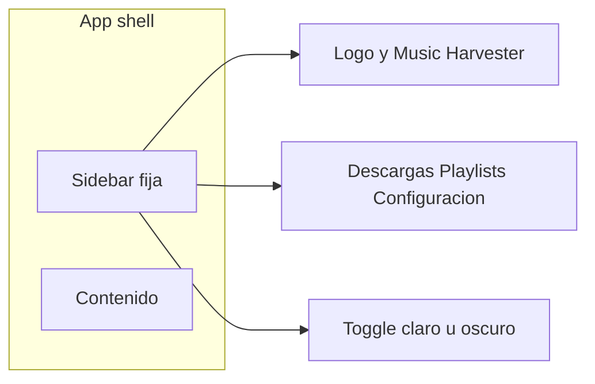

# UI: paleta Trinomio, sidebar y Descargas

## Paleta

Tomada de [trinom.io](https://trinom.io/) (colores computados del sitio):

- Acento: `#008ACE` (botones, highlights, links)
- Acento suave: `#E3F2FD` (caja info y estado activo, reemplaza el índigo `#eef2ff`)
- Texto: `#212529`
- Superficie oscura de marca: `#0C1319` (sección “Confían en nosotros”), base del modo oscuro
- Tipografía: Open Sans (la del sitio), en lugar de Inter

Centralizar todo en variables de [`frontend/src/styles.css`](frontend/src/styles.css) (`--accent`, `--accent-soft`, `--text`, `--surface`, `--bg`, `--border`, `--muted`) y sustituir hex sueltos en nav, badges de playlists, tabs de configuración e inputs (`#fff`, `#eef2ff`, `--primary`).

## Logotipo

Generar un ícono cuadrado, plano y legible a ~40px: cabeza de mosquetero de frente, bigote marcado, auriculares de vincha finos y modernos. Fondo azul `#008ACE`, trazo blanco, esquinas redondeadas (mismo rol que el logo de Retrokit). Guardarlo en [`frontend/public/`](frontend/public/) y usarlo en la marca de la sidebar y como favicon en [`frontend/src/index.html`](frontend/src/index.html).

## Barra lateral

Reemplazar el topbar de [`frontend/src/app/app.component.html`](frontend/src/app/app.component.html) por un layout de dos columnas:

- Ancho ~240px, fondo `--surface`, ítem activo con `--accent-soft` y texto `--accent` (como “Panel” en Retrokit).
- Ítems de esta entrega: **Descargas** (`/downloads`), **Playlists**, **Configuración**, cada uno con un ícono en [`frontend/src/app/shared/icon.component.ts`](frontend/src/app/shared/icon.component.ts) (`download`, `list`, `gear`; `sun` / `moon` para el tema).
- La épica de contenido (`.cursor/plans/v2_content_manager.plan.md`) suma después **Explorar** (`/browse`) entre Descargas y Playlists, con ícono `compass`. Esta entrega deja el componente de íconos y el markup de la nav listos para ese ítem, sin ruta muerta.
- En viewports angostos, la sidebar pasa a overlay con un botón de menú; el contenido deja de estar limitado a 960px centrados y usa el ancho restante.

## Descargas unificadas

Hoy hay dos rutas: `/` ([`download.component`](frontend/src/app/pages/download/download.component.html)) y `/downloads` ([`downloads.component`](frontend/src/app/pages/downloads/downloads.component.html), título “Cola e historial”).

- La vista de cola pasa a llamarse **Descargas**, con el mismo header que Playlists: título a la izquierda y botón **Nueva descarga** a la derecha.
- Ese botón (y el del estado vacío) abre un modal con el formulario actual: URL, proveedor, formato y validación. Reutilizar los estilos `.modal` ya usados en playlists.
- Conservar la lógica del formulario moviendo [`DownloadComponent`](frontend/src/app/pages/download/download.component.ts) a un diálogo embebido en la página de descargas. Al encolar, cerrar el modal, resetear el form y refrescar la tabla (hoy navega a `/downloads`).
- Rutas en [`frontend/src/app/app.routes.ts`](frontend/src/app/app.routes.ts): `''` redirige a `downloads`; se elimina la página suelta de nueva descarga.

## Modo oscuro

- `data-theme="dark"` en `<html>`, con tokens derivados de `#0C1319`: fondo `#0C1319`, superficie `#15202B`, texto claro, borde `#243040`, acento `#008ACE` (links un poco más claros, `#4DB6E8`).
- Un servicio chico persiste la elección en `localStorage`. Si no hay valor guardado, arranca con `prefers-color-scheme`.
- Botón al pie de la sidebar que alterna claro/oscuro.
- Ajustar pills de estado, alerts, toasts e inputs para que no queden con fondos claros fijos.
