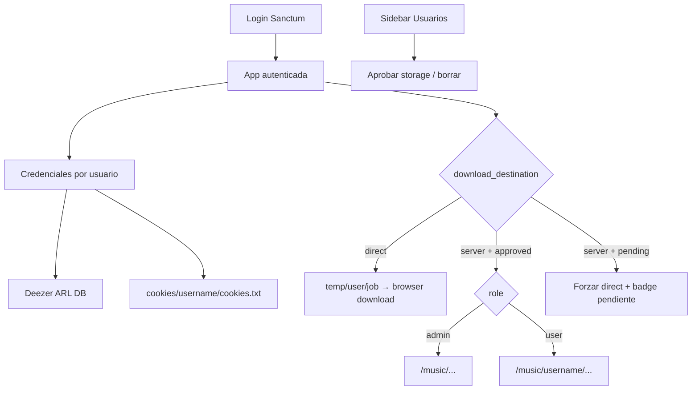

# Administrador de usuarios y tenancy

## Contexto

Hoy la API es abierta, settings/ARL/cookies son globales ([`EloquentSettingsRepository`](backend/app/Infrastructure/Persistence/EloquentSettingsRepository.php)), y [`download_jobs`](backend/database/migrations/2026_07_08_000001_create_download_jobs_table.php) / [`saved_playlists`](backend/database/migrations/2026_09_28_000002_create_saved_playlists_tables.php) no tienen dueño. Favoritos viven en `localStorage` ([`artist-favorites.service.ts`](frontend/src/app/core/artist-favorites.service.ts)). Nginx sirve frontend+API same-origin → **Laravel Sanctum SPA (cookies + CSRF)** es el mecanismo natural.

## Decisiones cerradas

- **Auth:** Sanctum SPA; middleware `auth:sanctum` en toda la API salvo health + endpoints de auth públicos.
- **Admin precargado:** seeder + env (`ADMIN_EMAIL`, `ADMIN_PASSWORD`, `ADMIN_USERNAME=admin`). Role `admin`, `server_storage=approved`, destino `server`, path de biblioteca = `MUSIC_PATH` **sin** `/{username}` (ej. `/music/...`).
- **Usuarios normales:** biblioteca en `{MUSIC_PATH}/{username}/...` solo si el admin aprobó storage; default destino = `direct` (browser).
- **Aprobación:** permiso **único** (`server_storage_status`: `none` | `pending` | `approved`). Elegir “guardar en servidor” sin aprobación → pasa a `pending` y solo puede usar `direct` hasta que el admin apruebe.
- **“Descarga a PC”:** el job **sigue corriendo en el server** (yt-dlp/streamrip); escribe en temp por usuario/job; al `done` el frontend descarga el artefacto vía API y luego se limpia el temp. No es download client-side puro.
- **Cookies YTM:** file input → `storage/app/private/cookies/{username}/cookies.txt` (volumen Docker writable). Path interno, no editable a mano.
- **ARL Deezer:** string por usuario en tabla de credenciales (nunca en settings globales).
- **Settings globales** (`music_path` root, concurrency, enabled_providers): solo editables por **admin**. Usuarios ven tabs de providers + destino de descarga.
- **Datos existentes:** migrar jobs/playlists/settings de providers al usuario admin.

## Backend

### 1. Modelo User + migraciones

Extender [`User`](backend/app/Models/User.php) y migrar:

- `first_name`, `last_name`, `username` (unique, slug `[a-z0-9_-]{3,32}`)
- `avatar_id` (string, catálogo fijo)
- `role` (`admin` | `user`)
- `server_storage_status` (`none` | `pending` | `approved`)
- `download_destination` (`direct` | `server`)
- Mantener `email`, `password`, `email_verified_at`

Tablas nuevas:

- `email_verification_codes`: `email`, `code` (4 dígitos), `expires_at`; unique por email
- `password_reset_codes`: `email`, `code` (8 dígitos), `expires_at`
- `user_provider_credentials`: `user_id`, `provider`, payload (`arl` text nullable / `cookies_path` nullable), unique `(user_id, provider)`
- `artist_favorites`: `user_id`, `provider`, `external_id`, `name`, `image_url`, unique por user+provider+id

Tenancy:

- `download_jobs.user_id` (+ índice)
- `saved_playlists.user_id` (+ índice)
- Migración de datos: asignar filas existentes al admin; copiar ARL/cookies globales a credenciales del admin

Instalar `laravel/sanctum`; CSRF cookie + login session.

### 2. Auth API

Handlers estilo CQRS existente:

| Endpoint | Notas |
|----------|--------|
| `POST /api/auth/register` | nombre, apellido, username, email, password+confirm, avatar_id → user sin verificar + mail con código 4 dígitos (30 min) |
| `POST /api/auth/verify-email` | email + code → set `email_verified_at` |
| `POST /api/auth/resend-verification` | rate-limit; invalida código anterior |
| `POST /api/auth/login` | solo si verificado |
| `POST /api/auth/logout` | |
| `GET /api/auth/me` | perfil + flags storage/destino/avatar |
| `POST /api/auth/forgot-password` | mail con link `{APP_URL}/reset-password?code=XXXXXXXX` (15 min) |
| `GET /api/auth/password-reset/validate?code=` | 200 o 422 inválido/expirado |
| `POST /api/auth/reset-password` | code + password+confirm |

Mailables Laravel; `MAIL_*` en `.env.example` (dev puede seguir en `log`).

### 3. Admin usuarios

- `GET /api/admin/users` — listado (middleware role admin)
- `DELETE /api/admin/users/{id}` — no borrar al propio admin logueado; cascade credentials/favorites; soft-cleanup cookies dir
- `POST /api/admin/users/{id}/approve-server-storage` — `pending` → `approved`

### 4. Credenciales + settings por rol

- Reescribir [`ProviderSettingsResolver`](backend/app/Application/Settings/ProviderSettingsResolver.php) para resolver ARL/cookies del **usuario autenticado** (fallback env solo para bootstrap/admin seed).
- `PUT /api/settings/providers/deezer` — ARL del user
- `POST /api/settings/providers/youtube-music/cookies` — multipart upload → escribe archivo bajo `{username}`
- `PUT /api/me/preferences` — `download_destination`; si pide `server` y status `none` → `pending`
- Settings generales (`music_path`, concurrency, enabled_providers): solo admin vía `/api/settings` actual

### 5. Pipeline de descarga / tenancy

- Al crear job: set `user_id`; path de salida:
  - admin + server → `{music_path}/...`
  - user + server + approved → `{music_path}/{username}/...`
  - direct → `storage/app/private/tmp-downloads/{user_id}/{job_id}/`
- Nuevo `GET /api/downloads/{id}/artifact` (auth + ownership): stream zip/archivo si destino era `direct` y status `done`; luego cleanup opcional
- Listados de downloads/playlists filtrados por `user_id`
- Sync de playlists usa el mismo resolver de path/credenciales del dueño
- Favoritos: CRUD API; frontend deja `localStorage`

Tests feature: register→verify→login, reset code expiry, admin approve, job path admin vs user, direct artifact, isolation entre users.

## Frontend

### 6. Shell auth

- Rutas públicas (sin sidebar app): `/login`, `/register`, `/verify-email`, `/forgot-password`, `/reset-password`
- Guard `authGuard` + `adminGuard`; interceptor HTTP con credentials + manejo 401 → login
- Layout app solo si autenticado; al boot `GET /me`

### 7. Flujos UI

- **Register:** campos pedidos + combo de avatares (grid de memes a color) + username
- **Verify:** input 4 dígitos + reenviar
- **Reset:** al entrar con `?code=` valida contra API; inválido → toast/error + redirect login; válido → form nueva password
- **Usuarios** (admin): tabla nombre/mail/username/storage status; aprobar; borrar
- **Settings:** tabs providers con upload cookies + ARL; preferencia destino descarga + estado “pendiente de aprobación”

### 8. Sidebar

En [`app.component.html`](frontend/src/app/app.component.html):

- Nav **Usuarios** → `/users` solo si `role === 'admin'`
- Footer (bajo theme): avatar + **solo first_name** + Logout

### 9. Avatars (estilo Make it Meme)

Catálogo estático ~12–16 SVG en `frontend/public/avatars/` — caras/personajes raros, planos, colores saturados (inspiración [Make it Meme](https://makeitmeme.com/es/): ilustración meme simple, no foto real). IDs tipo `meme-blob-01`. Sin dependencia externa en runtime.

## Fuera de alcance

- OAuth social, 2FA, roles más allá de admin/user
- Biblioteca YouTube Music (sigue fuera)
- Cuotas de disco / cuota por usuario
- Migrar favoritos existentes de `localStorage` (se pierden al pasar a API; aceptable)