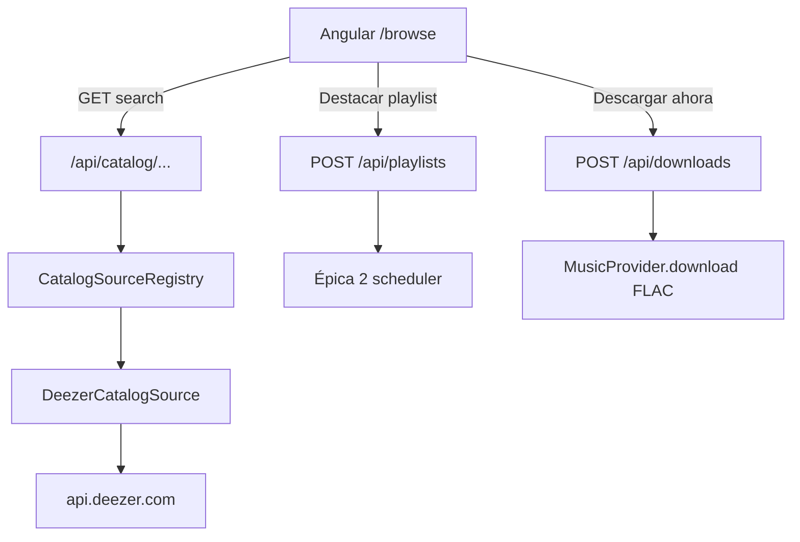

# Music Harvester v2 — Épica 3: Administrador de contenido

Parte de la separación en tres épicas. Depende de:

- Épica 1 [`v2_providers.plan.md`](v2_providers.plan.md): contrato `CatalogSource` + implementación Deezer (API pública)
- Épica 2 [`v2_playlists_sync_a9010a47.plan.md`](v2_playlists_sync_a9010a47.plan.md): `POST /api/playlists` para destacar

Alcance tipo **Murglar acotado**: buscar y abrir contenido del provider elegido; desde ahí descargar o destacar una playlist. Sin reproductor, radio, recomendaciones ni búsqueda cross-service.

## Por qué no scraping

Deezer expone catálogo público en `https://api.deezer.com`:

- `/search`, `/search/track|album|artist|playlist`
- `/artist/{id}`, `/artist/{id}/top`, `/artist/{id}/albums`
- `/album/{id}`, `/playlist/{id}` (+ tracks paginados)

Eso alcanza para búsqueda y fichas. El audio (FLAC) sigue yendo por el cliente autenticado de la épica 1; el catálogo no entrega archivos.

YouTube Music **no** tiene una API de catálogo equivalente usable de forma estable → fuera de la primera versión de `/browse`. La UI solo lista providers con `has_catalog: true` (desde `GET /api/providers`).

## Arquitectura

## 1. API de catálogo

Rutas en [`routes/api.php`](../../routes/api.php):

| Método | Ruta | Acción |
|--------|------|--------|
| GET | `/catalog/search` | Query: `provider` (required), `q`, `type` (track\|album\|artist\|playlist\|all), `limit`, `index` |
| GET | `/catalog/{provider}/artists/{id}` | Ficha artista + top tracks + álbumes |
| GET | `/catalog/{provider}/albums/{id}` | Ficha álbum + tracklist |
| GET | `/catalog/{provider}/playlists/{id}` | Ficha playlist + tracklist |
| GET | `/catalog/{provider}/tracks/{id}` | Detalle track (opcional; útil para deep-link) |

Handlers bajo `app/Application/Catalog/`:

- `SearchCatalogHandler`
- `GetCatalogArtistHandler` / `GetCatalogAlbumHandler` / `GetCatalogPlaylistHandler`

Validación:

- `provider` debe existir en `CatalogSourceRegistry` y estar en `enabled_providers`
- 404 si el source no implementa catálogo
- Rate-limit / timeout razonable hacia api.deezer.com

Resources JSON con campos estables para Angular: `id`, `title`, `subtitle` (artista), `cover_url`, `type`, `canonical_url`, contadores (`nb_tracks`, etc.).

Tests Feature con HTTP fake a `api.deezer.com` (no pegarle a la red en CI).

## 2. Frontend Angular `/browse`

Rutas en [`app.routes.ts`](../../frontend/src/app/app.routes.ts). El acceso no va en un topbar: es un ítem de la sidebar del plan UI sidebar Trinomio (si esa barra todavía no existe al implementar esta épica, el ítem se agrega a la nav que haya, con la misma etiqueta e ícono).

- Etiqueta: **Explorar**
- Ruta: `/browse`, con `routerLinkActive`
- Posición: entre **Descargas** y **Playlists**; **Configuración** queda al final
- Ícono: `compass` en [`icon.component.ts`](../../frontend/src/app/shared/icon.component.ts), mismo trazo que `download`, `list` y `gear` (brújula simple, legible a 20px). No reutilizar el logo del mosquetero

Pantallas:

- **`/browse`** — selector de provider (solo `has_catalog`) + campo de búsqueda + tabs o chips de tipo (Todo / Tracks / Álbumes / Artistas / Playlists)
- **`/browse/:provider/artists/:id`** — cover, nombre, top tracks, discografía; acciones por fila
- **`/browse/:provider/albums/:id`** — tracklist + “Descargar álbum”
- **`/browse/:provider/playlists/:id`** — tracklist + “Descargar playlist” + **“Destacar / sync automático”**
- Opcional: **`/browse/:provider/tracks/:id`** o acción directa desde resultados

Extender [`api.service.ts`](../../frontend/src/app/core/api.service.ts) y [`models.ts`](../../frontend/src/app/core/models.ts): `CatalogHit`, `CatalogArtist`, `CatalogAlbum`, `CatalogPlaylist`.

UX mínima alineada al resto de la app (misma tipografía / layout que settings y downloads); no copiar pixel-perfect Murglar.

## 3. Acciones que reutilizan épicas 1 y 2

### Descargar ahora

- Track / álbum / playlist → `POST /api/downloads` con `{ url: canonical_url, format?: flac|mp3_320|... }`
- Reutiliza el flujo one-shot existente; el provider Deezer de la épica 1 entrega FLAC si está en modo native + ARL HiFi
- Feedback: toast o link al job en `/downloads`

### Destacar playlist (combinar con sync)

- En ficha de playlist: botón “Destacar” / “Seguir y sincronizar”
- Llama `POST /api/playlists` con `{ url: canonical_url, sync_now: true, sync_enabled: true }`
- Si ya existe la misma URL, idempotente: devolver la existente o 409 con link
- Tras éxito: navegar a `/playlists/:id` o mostrar estado “sincronizando”
- A partir de ahí, tracks nuevos en esa playlist se descargan solos vía el scheduler de la épica 2

Sin UI de “favorites” aparte en v1 de esta épica: la lista de destacadas **es** `/playlists`.

## 4. Docs

- README / docs: cómo usar Explorar, qué providers aparecen, requisito ARL para descargar FLAC desde browse
- Flujo: buscar → destacar playlist → esperar sync / forzar sync
- Nota: catálogo público vs descarga autenticada

## Fuera de alcance (primera versión)

- Reproductor / cola / offline cache
- Radio, Flow, recomendaciones
- Búsqueda cross-service (varios providers a la vez)
- Letras (Genius, etc.)
- Catálogo YouTube Music
- Biblioteca local indexada (Audio Station sigue siendo la librería en disco)
- Auth multi-usuario

## Orden de implementación

1. Confirmar que épica 1 dejó `CatalogSource` + Deezer y épica 2 dejó `POST /api/playlists`
2. API `/api/catalog/...` + tests con HTTP fake
3. UI `/browse` búsqueda + resultados
4. Fichas artista / álbum / playlist
5. Acciones Descargar + Destacar
6. Docs

## Criterio de done

- Buscar “Daft Punk” en Deezer muestra artistas / álbumes / tracks
- Abrir un álbum y “Descargar” encola un job que produce FLAC (con ARL HiFi)
- “Destacar” una playlist la deja en `/playlists` con sync activo; un track nuevo remoto se descarga en el próximo sync
- Providers sin `CatalogSource` no aparecen en el selector de `/browse`
- **Explorar** está en la sidebar, entre Descargas y Playlists, con ícono `compass`, y queda activo en `/browse` y en las fichas
