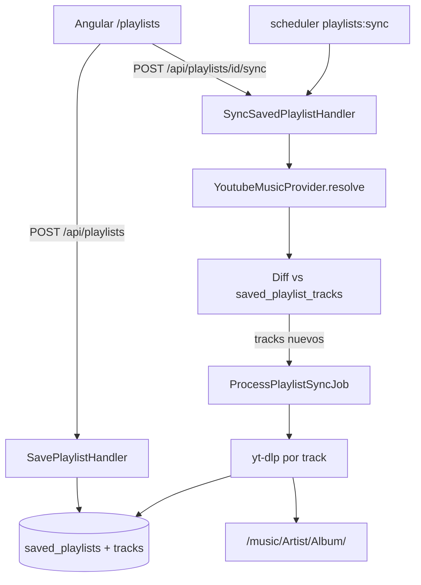

# Music Harvester v2 — Playlists guardadas y re-sync

## Contexto: qué ya existe en v1

Pegar una URL de playlist **ya funciona** en v1:

- [`CreateDownloadHandler`](app/Application/CreateDownload/CreateDownloadHandler.php) infiere `kind: playlist` si la URL tiene `list=` o ruta `/playlist|browse/`
- [`ProcessDownloadJob`](app/Jobs/ProcessDownloadJob.php) resuelve la playlist vía [`YoutubeMusicProvider`](app/Infrastructure/Providers/YoutubeMusic/YoutubeMusicProvider.php) y descarga todos los tracks en un solo job con progreso %
- La UI en [`download.component.html`](frontend/src/app/pages/download/download.component.html) ya menciona playlists

**Lo que v1 no tiene** (y es el foco de v2, según tu elección):

- Guardar playlists para reutilizarlas
- Detectar tracks nuevos en una playlist existente
- Re-sync manual (“Actualizar playlist”) y periódico (scheduler)
- Vista dedicada de playlists con estado por track

El plan v1 original ya mencionaba *“sync periódico de playlists”* como fuera de v1 ([`.cursor/plans/music_harvester_nas.plan.md`](.cursor/plans/music_harvester_nas.plan.md) línea 94). Este plan v2 lo implementa **solo para YouTube Music**.

---

## Objetivo v2



---

## Modelo de datos (SQLite)

Nuevas tablas; **no** duplicar la biblioteca de Audio Station.

### `saved_playlists`

| columna | tipo | notas |
|---------|------|-------|
| id | PK | |
| provider | string | `youtube_music` |
| url | text | URL canónica de la playlist |
| title | string | resuelto en primer sync |
| sync_enabled | bool | default true |
| sync_interval_hours | int | default 24 (configurable) |
| default_format | string | hereda de settings si null |
| last_synced_at | timestamp | nullable |
| last_sync_status | string | `idle`, `running`, `done`, `failed` |
| last_sync_error | text | nullable |
| created_at / updated_at | | |

### `saved_playlist_tracks`

| columna | tipo | notas |
|---------|------|-------|
| id | PK | |
| saved_playlist_id | FK | |
| external_id | string | YouTube video id |
| title, artist | string | metadata al resolver |
| position | int | orden en playlist |
| status | string | `pending`, `downloaded`, `failed`, `skipped` |
| file_path | text | nullable |
| download_job_id | FK nullable | link al job de descarga |
| last_error | text | nullable |
| first_seen_at | timestamp | cuándo apareció en sync |
| downloaded_at | timestamp | nullable |

Índice único: `(saved_playlist_id, external_id)`.

### Extensión opcional de `download_jobs`

Agregar `saved_playlist_id` nullable para filtrar jobs originados por sync. No es obligatorio en fase 1 si el link vive en `saved_playlist_tracks.download_job_id`.

---

## Backend (Laravel DDD)

Nuevos casos de uso bajo `app/Application/`:

| Handler | Responsabilidad |
|---------|-----------------|
| `SavePlaylist` | Validar URL YTM, resolver título, crear registro, disparar sync inicial |
| `ListSavedPlaylists` | Listar con contadores: total tracks, descargados, pendientes |
| `GetSavedPlaylist` | Detalle + tracks recientes |
| `UpdateSavedPlaylist` | sync_enabled, interval, format |
| `DeleteSavedPlaylist` | Borrar registro (no borrar archivos locales) |
| `SyncSavedPlaylist` | Resolver → diff → encolar descargas de tracks nuevos |

Nuevo job: **`ProcessPlaylistSyncJob`** (o extender `ProcessDownloadJob` con modo “solo pending tracks de playlist X”):

1. Marcar playlist `last_sync_status = running`
2. `YoutubeMusicProvider::resolve($url)` (reutilizar código existente)
3. Upsert tracks en `saved_playlist_tracks` (nuevos → `pending`; existentes → actualizar metadata/position)
4. Para cada track `pending`: descargar con lógica actual de [`ProcessDownloadJob`](app/Jobs/ProcessDownloadJob.php) (loop + progress)
5. Respetar `max_concurrency` de settings (1 por default en NAS)
6. Al terminar: `last_synced_at`, `last_sync_status = done`; si falla un track, marcar ese track `failed` pero **continuar** con los demás (mejora respecto a v1 donde un fallo aborta todo el job)

Repositorios en `app/Infrastructure/Persistence/`:
- `EloquentSavedPlaylistRepository`
- Contratos en `app/Domain/Music/Contracts/`

---

## API REST (prefijo `/api`)

| Método | Ruta | Acción |
|--------|------|--------|
| GET | `/playlists` | Listar playlists guardadas |
| POST | `/playlists` | `{ url, sync_now?: true }` — guardar (+ sync inicial opcional) |
| GET | `/playlists/{id}` | Detalle + tracks |
| PUT | `/playlists/{id}` | `{ sync_enabled, sync_interval_hours, default_format }` |
| DELETE | `/playlists/{id}` | Eliminar registro |
| POST | `/playlists/{id}/sync` | Sync manual → `202` |

Respuestas con Resources al estilo de [`DownloadJobResource`](app/Http/Resources/DownloadJobResource.php).

Validación: misma regla de URL que [`StoreDownloadRequest`](app/Http/Requests/StoreDownloadRequest.php); rechazar URLs no soportadas por el registry actual.

---

## Scheduler (re-sync periódico)

Aprovechar el servicio `scheduler` ya definido en [`docker-compose.yml`](docker-compose.yml):

```php
// routes/console.php
Schedule::command('playlists:sync')->hourly();
```

Comando `playlists:sync`:

- Seleccionar playlists con `sync_enabled = true` y `last_synced_at + sync_interval_hours <= now()`
- Excluir las que ya tienen sync `running`
- Despachar `SyncSavedPlaylist` por cada una

Configurable globalmente en `settings`: `default_sync_interval_hours` (opcional, fase 2 del v2).

---

## Frontend (Angular)

Nueva ruta y nav item:

- **`/playlists`** — listado de playlists guardadas
  - Botón “Agregar playlist” (modal o sub-ruta `/playlists/new`)
  - Por fila: título, URL, último sync, contadores, botones **Sincronizar** y **Configurar**
- **`/playlists/:id`** — detalle
  - Lista de tracks con status (`pending` / `downloaded` / `failed`)
  - Toggle sync automático + intervalo
  - Botón “Sincronizar ahora”

Servicio: extender [`ApiService`](frontend/src/app/core/api.service.ts) con métodos CRUD + sync.

La pantalla **`/`** (descarga one-shot) **se mantiene** para tracks/álbumes/playlists puntuales sin guardar.

---

## Comportamiento de sync (reglas de negocio)

- **Tracks nuevos**: se detectan por `external_id` (YouTube video id) no presente en la tabla
- **Tracks removidos de la playlist en YTM**: marcar como `skipped` o dejar en DB sin borrar archivos (recomendado: no borrar automáticamente)
- **Tracks ya descargados**: no re-descargar (`status = downloaded`); opcional flag futuro `force_redownload`
- **Cookies**: playlists privadas siguen dependiendo de cookies ([riesgo ya documentado en v1](.cursor/plans/music_harvester_nas.plan.md))
- **Carpeta destino**: mantener convención v1 `/music/{artist}/{album}/{index} - {title}.ext` ([`LocalMusicStorage`](app/Infrastructure/Storage/LocalMusicStorage.php)); no agrupar por nombre de playlist en v2 inicial (evita duplicados si el track ya existe en otro álbum)

---

## Orden de implementación sugerido

1. Migraciones + modelos de dominio + repositorios
2. `SyncSavedPlaylistHandler` + `ProcessPlaylistSyncJob` (sync manual, sin scheduler)
3. API REST + tests Feature (patrón de [`DownloadApiTest`](tests/Feature/DownloadApiTest.php))
4. Comando `playlists:sync` + schedule
5. UI Angular `/playlists`
6. Documentación breve en README (cómo agregar playlist, intervalo, cookies)

---

## Fuera de alcance v2 (v3+)

- Spotify playlists
- Borrado automático de archivos cuando un track sale de la playlist
- Carpeta dedicada `/music/Playlists/{nombre}/`
- Multi-usuario / auth

---

## Relación con el plan v1

Recomendación: **crear plan nuevo** (este) en `.cursor/plans/music_harvester_v2_playlists.plan.md` y dejar el plan v1 intacto como histórico. Opcionalmente agregar una línea al final del plan v1: *“v2: ver plan de playlists guardadas”*.
