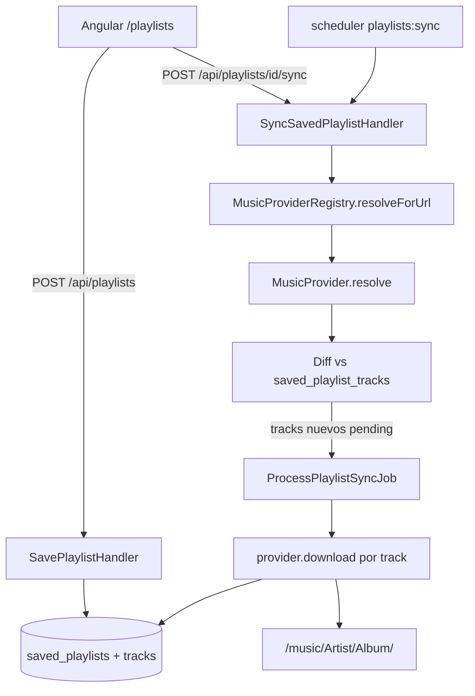

# Music Harvester v2 — Épica 2: Playlists guardadas y re-sync

Parte de la separación en tres épicas. Esta épica **no** incluye settings de Deezer, descarga FLAC, ni UI de búsqueda.

Planes relacionados:
- Épica 1: [`v2_providers.plan.md`](v2_providers.plan.md) — providers + Deezer FLAC
- Épica 3: [`v2_content_manager.plan.md`](v2_content_manager.plan.md) — búsqueda y “destacar playlist”

Puede construirse **en paralelo** con la épica 1 sobre YouTube Music. El schema guarda `provider` desde el día uno; cuando exista `DeezerProvider`, una URL Deezer entra al mismo sync sin cambiar este código.

## Contexto: qué ya existe en v1

Pegar una URL de playlist **ya funciona** en v1:

- [`CreateDownloadHandler`](../../app/Application/CreateDownload/CreateDownloadHandler.php) infiere `kind: playlist` si la URL tiene `list=` o ruta `/playlist|browse/`
- [`ProcessDownloadJob`](../../app/Jobs/ProcessDownloadJob.php) resuelve la playlist y descarga todos los tracks en un solo job con progreso %
- La UI en download ya menciona playlists
- [`MusicProviderRegistry::resolveForUrl`](../../app/Infrastructure/Providers/MusicProviderRegistry.php) elige el provider por URL

**Lo que v1 no tiene** (foco de esta épica):

- Guardar playlists para reutilizarlas
- Detectar tracks nuevos en una playlist existente
- Re-sync manual (“Actualizar playlist”) y periódico (scheduler)
- Vista dedicada de playlists con estado por track

## Objetivo


```mermaid
flowchart TD
  UI[Angular /playlists] -->|POST /api/playlists| Save[SavePlaylistHandler]
  Save --> DB[(saved_playlists + tracks)]
  UI -->|POST /api/playlists/id/sync| Sync[SyncSavedPlaylistHandler]
  Cron[scheduler playlists:sync] --> Sync
  Sync --> Reg[MusicProviderRegistry.resolveForUrl]
  Reg --> Provider[MusicProvider.resolve]
  Provider --> Diff[Diff vs saved_playlist_tracks]
  Diff -->|tracks nuevos pending| Queue[ProcessPlaylistSyncJob]
  Queue --> ProviderDownload[provider.download por track]
  ProviderDownload --> MusicDir["/music/Artist/Album/"]
  ProviderDownload --> DB
```

## Modelo de datos (SQLite)

Nuevas tablas; **no** duplicar la biblioteca de Audio Station.

### `saved_playlists`

| columna | tipo | notas |
|---------|------|-------|
| id | PK | |
| provider | string | Nombre del provider del registry (`youtube_music`, `deezer`, …) — resuelto desde la URL al guardar |
| url | text | URL canónica de la playlist |
| title | string | resuelto en primer sync |
| sync_enabled | bool | default true |
| sync_interval_hours | int | default 24 (configurable) |
| default_format | string | hereda de settings si null |
| last_synced_at | timestamp | nullable |
| last_sync_status | string | `idle`, `running`, `done`, `failed` |
| last_sync_error | text | nullable |
| created_at / updated_at | | |

### `saved_playlist_tracks`

| columna | tipo | notas |
|---------|------|-------|
| id | PK | |
| saved_playlist_id | FK | |
| external_id | string | ID del track en el provider (video id YTM, deezer track id, …) |
| title, artist | string | metadata al resolver |
| position | int | orden en playlist |
| status | string | `pending`, `downloaded`, `failed`, `skipped` |
| file_path | text | nullable |
| download_job_id | FK nullable | link al job de descarga |
| last_error | text | nullable |
| first_seen_at | timestamp | cuándo apareció en sync |
| downloaded_at | timestamp | nullable |

Índice único: `(saved_playlist_id, external_id)`.

### Extensión opcional de `download_jobs`

Agregar `saved_playlist_id` nullable para filtrar jobs originados por sync. No es obligatorio en fase 1 si el link vive en `saved_playlist_tracks.download_job_id`.

## Backend (Laravel DDD)

Nuevos casos de uso bajo `app/Application/`:

| Handler | Responsabilidad |
|---------|-----------------|
| `SavePlaylist` | Validar URL vía registry, setear `provider` desde `resolveForUrl()->name()`, resolver título, crear registro, disparar sync inicial |
| `ListSavedPlaylists` | Listar con contadores: total tracks, descargados, pendientes |
| `GetSavedPlaylist` | Detalle + tracks recientes |
| `UpdateSavedPlaylist` | sync_enabled, interval, format |
| `DeleteSavedPlaylist` | Borrar registro (no borrar archivos locales) |
| `SyncSavedPlaylist` | Resolver → diff → encolar descargas de tracks nuevos |

Nuevo job: **`ProcessPlaylistSyncJob`**:

1. Marcar playlist `last_sync_status = running`
2. `$registry->resolveForUrl($url)->resolve($url)` — **no** llamar a `YoutubeMusicProvider` directo
3. Upsert tracks en `saved_playlist_tracks` (nuevos → `pending`; existentes → actualizar metadata/position)
4. Para cada track `pending`: descargar reusando lógica de [`ProcessDownloadJob`](../../app/Jobs/ProcessDownloadJob.php) (delay, progress); marcar `downloaded` / `failed` sin abortar el resto
5. Respetar `max_concurrency` de settings (1 por default en NAS)
6. Al terminar: `last_synced_at`, `last_sync_status = done`

Repositorios en `app/Infrastructure/Persistence/`:
- `EloquentSavedPlaylistRepository`
- Contratos en `app/Domain/Music/Contracts/`
- Registrar en [`MusicHarvesterServiceProvider`](../../app/Providers/MusicHarvesterServiceProvider.php)

Setting opcional: `default_sync_interval_hours` (default 24).

## API REST (prefijo `/api`)

| Método | Ruta | Acción |
|--------|------|--------|
| GET | `/playlists` | Listar playlists guardadas |
| POST | `/playlists` | `{ url, sync_now?: true, sync_enabled?: true }` — guardar (+ sync inicial opcional) |
| GET | `/playlists/{id}` | Detalle + tracks |
| PUT | `/playlists/{id}` | `{ sync_enabled, sync_interval_hours, default_format }` |
| DELETE | `/playlists/{id}` | Eliminar registro |
| POST | `/playlists/{id}/sync` | Sync manual → `202` |

Respuestas con Resources al estilo de [`DownloadJobResource`](../../app/Http/Resources/DownloadJobResource.php).

Validación: misma regla de URL que [`StoreDownloadRequest`](../../app/Http/Requests/StoreDownloadRequest.php); rechazar URLs sin provider en el registry (`resolveForUrl === null`).

## Scheduler (re-sync periódico)

Aprovechar el servicio `scheduler` ya definido en [`docker-compose.yml`](../../docker-compose.yml):

```php
// routes/console.php
Schedule::command('playlists:sync')->hourly();
```

Comando `playlists:sync`:

- Seleccionar playlists con `sync_enabled = true` y `last_synced_at + sync_interval_hours <= now()`
- Excluir las que ya tienen sync `running`
- Despachar `SyncSavedPlaylist` por cada una

## Frontend (Angular)

Nueva ruta y nav item:

- **`/playlists`** — listado de playlists guardadas
  - Botón “Agregar playlist” (modal o sub-ruta `/playlists/new`)
  - Por fila: título, **badge provider**, último sync, contadores, botones **Sincronizar** y **Configurar**
- **`/playlists/:id`** — detalle
  - Lista de tracks con status (`pending` / `downloaded` / `failed` / `skipped`)
  - Toggle sync automático + intervalo
  - Botón “Sincronizar ahora”

Servicio: extender [`ApiService`](../../frontend/src/app/core/api.service.ts) con CRUD + sync; modelos `SavedPlaylist`, `SavedPlaylistTrack` en [`models.ts`](../../frontend/src/app/core/models.ts).

La pantalla **`/`** (descarga one-shot) **se mantiene** para tracks/álbumes/playlists puntuales sin guardar.

## Comportamiento de sync (reglas de negocio)

- **Tracks nuevos**: `external_id` del provider no presente en la tabla
- **Tracks removidos** de la playlist remota: marcar `skipped` (no borrar archivos locales)
- **Tracks ya descargados**: no re-descargar (`status = downloaded`); opcional flag futuro `force_redownload`
- **Credenciales**: playlists privadas / Deezer dependen de las credenciales del provider (épica 1); si el provider no está configurado, el sync falla con error claro
- **Carpeta destino**: mantener convención v1 `/music/{artist}/{album}/...` ([`LocalMusicStorage`](../../app/Infrastructure/Storage/LocalMusicStorage.php)); no agrupar por nombre de playlist en esta épica

## Orden de implementación

1. Migraciones + modelos de dominio + repositorios
2. `SyncSavedPlaylistHandler` + `ProcessPlaylistSyncJob` (sync manual, sin scheduler)
3. API REST + tests Feature (patrón de [`DownloadApiTest`](../../tests/Feature/DownloadApiTest.php))
4. Comando `playlists:sync` + schedule
5. UI Angular `/playlists`
6. Documentación breve en README

## Fuera de alcance

- Implementación de Deezer / ARL / FLAC → épica 1
- Búsqueda de catálogo / “destacar desde browse” → épica 3 (consumirá `POST /api/playlists`)
- Spotify u otros providers nuevos
- Borrado automático de archivos cuando un track sale de la playlist
- Carpeta dedicada `/music/Playlists/{nombre}/`
- Multi-usuario / auth

## Criterio de done

- Guardar una playlist de YouTube Music, sync manual descarga todos los tracks
- Agregar un track nuevo en YTM y re-sync descarga solo ese track
- Scheduler respeta `sync_interval_hours`
- El código de sync no importa `YoutubeMusicProvider` — solo el registry
- Con épica 1 completa, la misma UI acepta una URL Deezer sin cambios en el handler de sync
