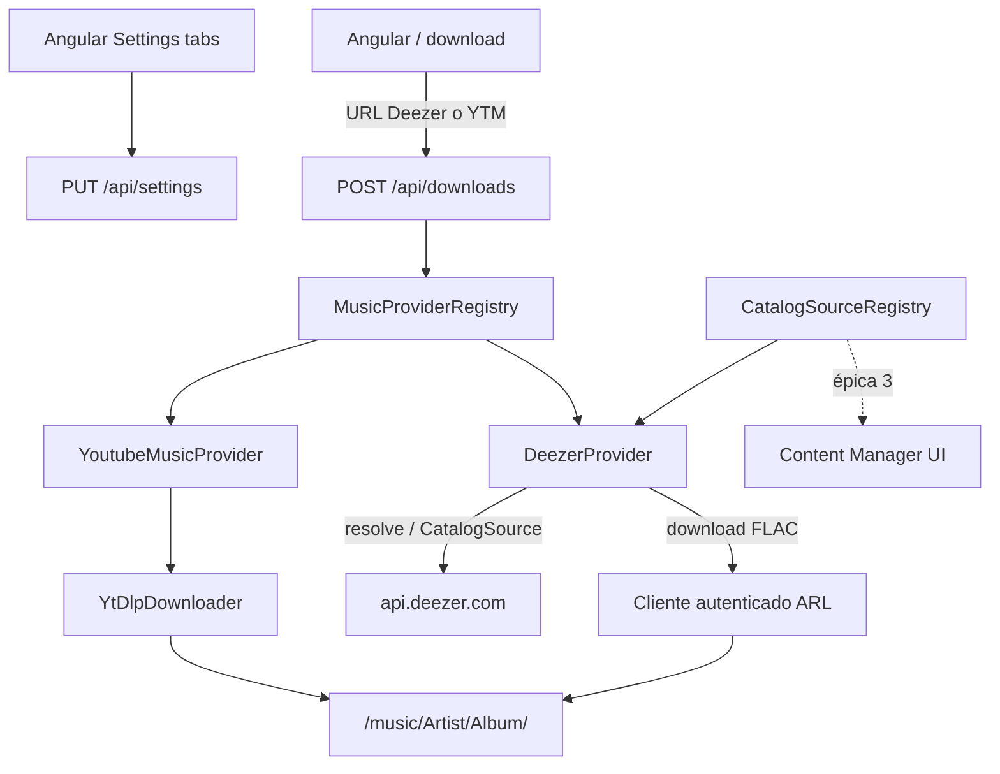

# Music Harvester v2 — Épica 1: Proveedores extensibles + Deezer FLAC

Parte de la separación en tres épicas (ver plan maestro *Tres epicas v2*). Esta épica **no** incluye sync de playlists ni administrador de contenido.

Planes relacionados:
- Épica 2: [`v2_playlists_sync_a9010a47.plan.md`](v2_playlists_sync_a9010a47.plan.md)
- Épica 3: [`v2_content_manager.plan.md`](v2_content_manager.plan.md)

Planes reemplazados (no implementar): [`v2_playlists_multiprovider_3a4150ed.plan.md`](v2_playlists_multiprovider_3a4150ed.plan.md), [`v2_multi-provider_deezer.plan.md`](v2_multi-provider_deezer.plan.md).

## Objetivo

Agregar un provider nuevo = registrar una clase, sus credenciales y las calidades que entrega. Deezer es el primer provider aparte de YouTube Music, con descarga en **FLAC** (cuenta HiFi) o MP3 320.

## Qué ya existe

- Contrato [`MusicProvider`](../../app/Domain/Music/Contracts/MusicProvider.php): `name`, `supports`, `resolve`, `download`.
- [`MusicProviderRegistry`](../../app/Infrastructure/Providers/MusicProviderRegistry.php) (`resolveForUrl`, `all`).
- Tag `music.providers` en [`MusicHarvesterServiceProvider`](../../app/Providers/MusicHarvesterServiceProvider.php) — hoy solo `YoutubeMusicProvider`.
- Settings planos: `music_path`, `default_format`, `max_concurrency`, `cookies_path` en [`EloquentSettingsRepository::KEYS`](../../app/Infrastructure/Persistence/EloquentSettingsRepository.php).
- [`AudioFormat`](../../app/Domain/Music/ValueObjects/AudioFormat.php): solo `mp3_320` y `m4a`.
- Descarga one-shot vía `POST /api/downloads` + [`ProcessDownloadJob`](../../app/Jobs/ProcessDownloadJob.php).

## Arquitectura objetivo



## Decisiones

| Tema | Decisión |
|------|----------|
| Catálogo Deezer | API pública `api.deezer.com` — sin scraping |
| Audio FLAC | Cliente autenticado con ARL (Premium/HiFi); **no** yt-dlp (removió Deezer) |
| Híbrido YT | Solo fallback si no hay ARL; calidad = YouTube; documentado |
| Docker slim | Fuera de alcance (ya resuelto) |
| Playlists / sync / búsqueda UI | Épicas 2 y 3 |

## 1. Settings por proveedor

Ampliar `KEYS` en [`EloquentSettingsRepository`](../../app/Infrastructure/Persistence/EloquentSettingsRepository.php):

- `provider_youtube_music_cookies_path` — migrar desde `cookies_path` existente
- `provider_deezer_arl` — token ARL (secreto; no commitear)
- `provider_deezer_mode` — `native` (default) \| `hybrid`
- `enabled_providers` — default `youtube_music,deezer`
- Mantener: `music_path`, `default_format`, `max_concurrency`

Migración de datos / env:

- Copiar valor de `cookies_path` → `provider_youtube_music_cookies_path` si el nuevo key está vacío.
- Mapear `COOKIES_PATH` y opcional `DEEZER_ARL` en [`config/music.php`](../../config/music.php).
- Layout de volúmenes recomendado: `cookies/youtube/cookies.txt`, ARL en settings o archivo `cookies/deezer/arl` (documentar ambos).

[`GetSettingsHandler`](../../app/Application/GetSettings/GetSettingsHandler.php) / [`UpdateSettingsHandler`](../../app/Application/UpdateSettings/UpdateSettingsHandler.php) / Resource: exponer estado por proveedor (`cookies_configured` → por provider; `arl_configured` booleano sin devolver el ARL en claro si se prefiere mask).

## 2. Dominio: formato + opciones + catálogo

- Extender [`AudioFormat`](../../app/Domain/Music/ValueObjects/AudioFormat.php) con `Flac = 'flac'` (`extension(): flac`, label “FLAC lossless”).
- [`DownloadOptions`](../../app/Domain/Music/ValueObjects/DownloadOptions.php): agregar `public string $provider` y credenciales genéricas o paths por provider (evitar hardcodear solo cookies YT).
- [`ProcessDownloadJob::buildOptions()`](../../app/Jobs/ProcessDownloadJob.php): leer credenciales según `provider` del job / URL resuelta.

Nuevo contrato:

```php
interface CatalogSource
{
    public function name(): string;
    /** @return list<CatalogHit> */
    public function search(string $query, CatalogType $type, int $limit = 25): array;
    public function getArtist(string $id): CatalogArtist;
    public function getAlbum(string $id): CatalogAlbum;
    public function getPlaylist(string $id): CatalogPlaylist;
}
```

Value objects mínimos en `app/Domain/Music/ValueObjects/`: `CatalogHit`, `CatalogArtist`, `CatalogAlbum`, `CatalogPlaylist`, `CatalogType` (track|album|artist|playlist). Incluyen `id`, títulos, cover URL, y URL canónica del provider para reutilizar `resolve`/`download`.

`CatalogSourceRegistry` espejo del registry de providers (tag `music.catalog_sources`). Un provider puede implementar ambos contratos o solo `MusicProvider`.

## 3. API providers

- `GET /api/providers` en [`routes/api.php`](../../routes/api.php): lista de `enabled_providers` con `{ name, configured, qualities: string[], has_catalog: bool, mode?: string }`.
- `POST /api/downloads`: override opcional `provider` (Auto / youtube_music / deezer); validación: URL debe ser soportada por el provider elegido o por `resolveForUrl`.

Tests Feature al estilo [`SettingsApiTest`](../../tests/Feature/SettingsApiTest.php) / [`DownloadApiTest`](../../tests/Feature/DownloadApiTest.php).

## 4. Spike cliente FLAC + DeezerProvider

### Spike (antes de wiring completo)

Evaluar clientes mantenidos que lean ARL y entreguen FLAC:

- streamrip
- orpheusdl (+ módulo Deezer)
- deezer-py / wrappers activos

Criterios: mantiene build Docker worker, licencia usable, ARL estable, soporte FLAC HiFi. **No asumir deemix vivo.** Documentar el elegido en README / docs.

### DeezerProvider

Nuevo `app/Infrastructure/Providers/Deezer/`:

- `DeezerProvider` implementa `MusicProvider` (+ opcionalmente `CatalogSource` en la misma clase o `DeezerCatalogSource` aparte).
- `name(): 'deezer'`
- `supports()`: `deezer.com/(track|album|playlist)/...`, `www.deezer.com`, `link.deezer.com` (seguir redirect o parsear).
- `resolve()`: HTTP a `api.deezer.com` (`/track/{id}`, `/album/{id}`, `/playlist/{id}` + paginación de tracks) → `ResolvedMusic` con `external_id = deezer_track_id`, artist, title, album.
- `download()` modo `native`: invocar el cliente del spike con ARL + `AudioFormat::Flac` (o 320 si la cuenta no es HiFi / setting).
- `download()` modo `hybrid`: `YoutubeMusicMatcher` (`ytsearch1:"artista titulo"`) + `YtDlpDownloader` + cache opcional `track_matches` — **solo si `provider_deezer_mode=hybrid` o ARL ausente**.

Registrar en [`MusicHarvesterServiceProvider`](../../app/Providers/MusicHarvesterServiceProvider.php) con tags `music.providers` y `music.catalog_sources`.

Worker Docker: instalar el CLI/runtime del cliente elegido (Python pip o binario) en la imagen `worker`, no necesariamente en `app`.

## 5. Frontend (solo settings + descarga)

- [`settings.component.ts`](../../frontend/src/app/pages/settings/settings.component.ts): tabs **General | YouTube Music | Deezer**.
  - YTM: path cookies + estado configured.
  - Deezer: campo ARL (password-like), toggle mode native/hybrid, aviso de calidad.
- [`download.component`](../../frontend/src/app/pages/download/): badge “Detectado: YouTube Music / Deezer”; selector override Auto/YT/Deezer; formatos incluyen FLAC cuando el provider detectado lo declara en `qualities`.
- Extender [`models.ts`](../../frontend/src/app/core/models.ts) y [`api.service.ts`](../../frontend/src/app/core/api.service.ts): `Provider`, `AudioFormat` + `flac`, settings por proveedor, `getProviders()`.

**Sin** rutas `/browse` ni `/playlists` en esta épica.

## 6. Docs

Actualizar [`docs/synology.md`](../../docs/synology.md) y README:

- Cómo exportar cookies YTM y dónde montarlas.
- Cómo obtener ARL Deezer (cookie `arl` en deezer.com) y rotación al caducar.
- Requisito de cuenta HiFi para FLAC.
- Limitaciones del modo híbrido.
- Cómo agregar un provider futuro (implementar contratos + tag + settings keys).

## Fuera de alcance

- `saved_playlists` / scheduler / UI `/playlists` → épica 2
- UI de búsqueda / fichas artista-álbum → épica 3
- Endpoints HTTP de catálogo (`/api/catalog/...`) → pueden stubbearse aquí vía contratos; la API REST de catálogo se expone en épica 3 (o se deja el contrato listo y la API se agrega en épica 3)
- Spotify / otros providers
- Imagen Docker slim

**Nota API catálogo:** implementar `CatalogSource` + `DeezerCatalogSource` en esta épica (contratos + implementación); la capa HTTP Angular llega en épica 3. Opcional: exponer ya `GET /api/catalog/...` sin UI para poder probar con curl.

## Orden de implementación

1. Settings + migración cookies + `AudioFormat::Flac`
2. Contratos `CatalogSource` + registries filtrados por `enabled_providers`
3. `GET /api/providers` + ajustes download job/options
4. Spike cliente FLAC → wiring en worker
5. `DeezerProvider` resolve (API pública) + download native
6. Fallback hybrid documentado
7. Angular settings tabs + badge en download
8. Docs

## Criterio de done

- Pegar URL `https://www.deezer.com/track/...` en `/` descarga FLAC (con ARL HiFi) a `/music/...`
- Settings muestran YTM y Deezer configurados por separado
- `GET /api/providers` lista ambos con `qualities` correctas
- Agregar otro provider futuro no requiere tocar el código de YTM, solo una nueva clase + registro
